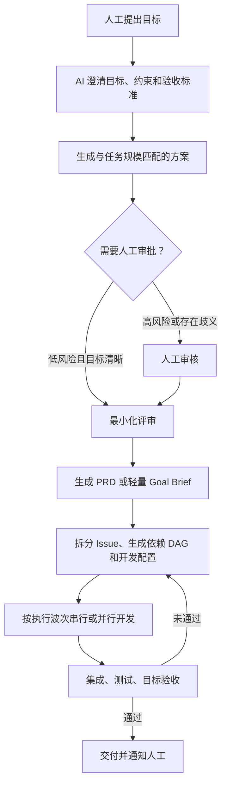

# 七阶段 AI 开发 Harness 方案

## 1. 背景与目标

这套 Harness 用于管理从人工提出开发目标，到 AI 完成需求澄清、方案设计、任务拆分、串并行开发、集成验收和交付通知的完整过程。

Harness 的最终完成条件不是“所有 Issue 已关闭”，而是：

> 原始目标已经实现，验收标准已经通过，并且不存在未披露的阻塞问题。

## 2. 总体流程



## 3. 七个阶段

### 阶段一：目标定义

#### 目的

把人工提出的自然语言目标转换成可验证的任务目标，避免 AI 在错误或模糊的方向上持续开发。

#### 必须明确的内容

- 要解决的问题
- 目标用户或使用场景
- 成功标准
- 非目标
- 时间、技术和业务约束
- 是否允许修改接口、数据库、依赖或部署方式
- 必须由人工决定的事项

#### 输出

`goal.md`，至少包含：

```yaml
goal:
  problem: ""
  expected_outcome: ""
  acceptance_criteria: []
  non_goals: []
  constraints: []
  human_decisions_required: []
```

#### 完成条件

- 目标可以被测试或观察。
- 每条验收标准都有明确的通过条件。
- 非目标和修改边界已经记录。

---

### 阶段二：自适应澄清

#### 目的

根据任务规模和风险决定流程深度，避免小任务承担完整 PRD 和多轮审批的成本。

#### 建议分级

| 等级 | 典型任务 | 流程要求 |
|---|---|---|
| S | 局部修复、机械性修改 | Goal Brief，通常不需要人工方案审批 |
| M | 单模块功能 | Mini PRD、技术方案、一次人工审批 |
| L | 跨模块或跨仓库功能 | 完整 PRD、架构方案、风险分析 |
| XL | 高风险迁移、安全或核心架构改造 | 完整方案、迁移与回滚计划、多个人工门禁 |

#### 评估维度

- 需求清晰度
- 影响模块数量
- 是否修改公共接口
- 数据迁移和兼容性风险
- 安全与合规风险
- 是否需要多个 Agent
- 失败后的恢复成本

#### 输出

`classification.json`：

```json
{
  "size": "S|M|L|XL",
  "risk": "low|medium|high|critical",
  "required_artifacts": [],
  "required_human_gates": [],
  "reason": ""
}
```

#### 完成条件

- 已选择与任务风险相匹配的流程。
- 所需产物和人工门禁已经确定。

---

### 阶段三：最小方案与过度设计评审

#### 目的

确保方案只包含完成原始目标所必需的设计，同时允许人工明确批准有价值但非必需的扩展。

#### 评审问题

- 每个模块是否直接服务于某条验收标准？
- 删除该部分后，原始目标是否仍可完成？
- 是否在为尚未出现的需求提前设计？
- 是否新增了不必要的抽象、框架、服务或配置系统？
- 是否存在成本更低、维护责任更小的实现？
- 当前复杂度是来自真实约束，还是来自模型假设？

#### 分类

| 分类 | 定义 | 默认处理 |
|---|---|---|
| Required | 完成目标必须存在 | 保留 |
| Helpful | 有明确收益，但可以推迟 | 默认删除，人工可批准 |
| Speculative | 服务于未经确认的未来需求 | 删除 |

#### 人工决策

人工可以：

- 批准最小方案
- 要求修改
- 驳回方案
- 明确允许某个 `Helpful` 项

人工批准的非必需项必须记录批准人、理由和时间，不能由模型自行保留。

#### 输出

- `proposal.md`
- `overdesign-review.json`
- `approved-scope.md`

`overdesign-review.json` 示例：

```json
{
  "items": [
    {
      "id": "DESIGN-001",
      "name": "插件系统",
      "classification": "speculative",
      "related_acceptance_criteria": [],
      "decision": "remove",
      "reason": "当前目标只有一个固定实现，不需要扩展机制"
    }
  ],
  "result": "pass|needs_revision|human_exception"
}
```

#### 完成条件

- 所有方案内容都已分类。
- `Speculative` 项已经删除。
- 被保留的 `Helpful` 项已有人工批准记录。
- 方案无明显过度设计，或人工明确接受剩余复杂度。

---

### 阶段四：产出规格

#### 目的

生成与任务规模相匹配、能够直接指导 Issue 拆分和最终验收的规格。

#### 产物策略

| 任务等级 | 建议产物 |
|---|---|
| S | Goal Brief 和验收标准 |
| M | Mini PRD 和技术方案 |
| L | 完整 PRD、技术方案和风险清单 |
| XL | 上述内容，加迁移、兼容和回滚计划 |

#### PRD 必须包含

- 背景和问题
- 目标
- 非目标
- 用户场景
- 功能需求
- 验收标准
- 技术与业务约束
- 已批准的方案
- 已知风险
- 明确排除的过度设计

#### 输出

- `prd.md` 或 `goal-brief.md`
- 必要时生成 `architecture.md`
- 必要时生成 `migration-and-rollback.md`

#### 完成条件

- PRD 与 `approved-scope.md` 一致。
- 每项需求可以追溯到目标或验收标准。
- 没有重新引入已经删除的过度设计。

---

### 阶段五：Issue 拆分

#### 目的

把规格拆成可以独立开发和验证的工作单元，并生成依赖关系、开发提示词和执行配置。

#### 每个 Issue 必须包含

- Issue 目标
- 不做什么
- 输入和预期输出
- 对应的需求和验收标准
- 允许修改的代码范围
- 预计影响的文件或模块
- 依赖的 Issue
- 测试要求
- 完成证据
- 开发提示词
- 推荐模型能力等级
- 推荐推理强度

#### 模型能力分级

| Issue 类型 | 模型能力 | 推理强度 |
|---|---|---|
| 机械性修改 | 成本优先 | 低 |
| 单模块功能 | 通用编码 | 中 |
| 跨模块重构 | 强编码与上下文理解 | 高 |
| 架构、并发、安全问题 | 最强可用模型 | 高或最高 |
| 独立评审 | 独立上下文，必要时不同模型 | 中到高 |

具体模型名称不写死，由运行时根据能力、成本、可用性和组织策略映射。

#### 输出

`issues.json`：

```json
{
  "issues": [
    {
      "id": "ISSUE-001",
      "title": "",
      "goal": "",
      "out_of_scope": [],
      "requirements": [],
      "acceptance_criteria": [],
      "dependencies": [],
      "expected_files": [],
      "tests": [],
      "completion_evidence": [],
      "development_prompt": "",
      "model_capability": "general_coding",
      "reasoning_effort": "medium",
      "status": "pending"
    }
  ]
}
```

#### 完成条件

- 依赖关系组成无环图。
- 每个 Issue 都可以独立验收。
- 所有 PRD 需求都至少被一个 Issue 覆盖。
- 没有 Issue 服务于已删除的过度设计。

---

### 阶段六：调度执行

#### 目的

根据依赖关系和代码冲突自动生成执行波次，选择串行或并行开发。

#### 调度条件

一个 Issue 只有同时满足以下条件才可以执行：

- 所有依赖 Issue 已完成并通过局部验证
- 没有与当前执行 Issue 产生不可隔离的文件冲突
- 依赖的公共接口或数据结构已经稳定
- 运行环境和凭证可用
- 所需人工审批已经通过

#### 并行冲突检查

- 是否修改相同文件
- 是否修改同一公共接口
- 是否修改同一数据库结构
- 是否依赖共享的可变运行环境
- 是否会产生难以自动合并的语义冲突

#### 执行波次示例

```text
Wave 1: ISSUE-A、ISSUE-B 并行
Wave 2: ISSUE-C 依赖 A；ISSUE-D 依赖 B
Wave 3: ISSUE-E 依赖 C 和 D，串行集成
Wave 4: 回归测试与目标验收
```

#### 执行要求

- 每个并行 Agent 使用独立 Worktree、分支或隔离工作区。
- 每个 Issue 完成后执行局部测试并提交完成证据。
- 失败时记录失败类型、重试次数和上下文。
- 超过重试上限或发现需求歧义时转人工处理。
- 合并后重新计算后续执行波次。

#### 输出

- `execution-plan.json`
- `execution-state.json`
- Agent 日志
- 每个 Issue 的代码变更和测试证据

#### 完成条件

- 所有必需 Issue 已完成。
- 局部测试通过。
- 代码已经进入待集成状态。
- 不以 Issue 状态作为最终交付依据。

---

### 阶段七：集成交付

#### 目的

验证所有 Issue 合并后是否真正完成了原始目标，并向人工提供可复核的交付信息。

#### 最终完成公式

```text
Issue 完成
+ 成功集成
+ 自动化测试通过
+ 原始验收标准通过
+ 没有未披露的阻塞问题
= 可以交付
```

#### 验证内容

- 合并和构建是否成功
- 单元、集成和端到端测试是否通过
- 每条原始验收标准是否通过
- 非目标是否仍然未被实现
- 是否重新引入过度设计
- 是否存在安全、迁移、兼容或回滚风险

#### 失败处理

如果最终验收失败：

1. 记录失败的验收标准和证据。
2. 判断是实现缺陷、Issue 遗漏、规格错误还是集成问题。
3. 生成或修订 Issue。
4. 返回阶段五或阶段六。
5. 重新执行集成验收。

#### 交付通知必须包含

- 原始目标是否达成
- 已完成的内容
- 测试与验收结果
- 有意删除的过度设计
- 人工批准保留的非必需设计
- 剩余风险和已知限制
- 需要人工重点检查的内容
- 代码、PR、构建产物和交付报告位置

#### 输出

`delivery.md` 和机器可读的 `delivery.json`。

#### 完成条件

- 所有原始验收标准通过。
- 所有失败和风险已经披露。
- 交付报告已经生成。
- 已向人工发送“开发完成，等待验收”的通知。

## 4. 建议状态机

```text
DRAFT_GOAL
→ CLARIFYING
→ WAITING_FOR_PLAN_APPROVAL
→ REVIEWING_OVERDESIGN
→ WAITING_FOR_SCOPE_APPROVAL
→ SPEC_READY
→ ISSUES_READY
→ EXECUTING
→ INTEGRATING
→ VERIFYING
→ DELIVERED
```

异常状态：

```text
BLOCKED
NEEDS_CLARIFICATION
NEEDS_REPLAN
NEEDS_HUMAN_DECISION
CANCELLED
```

## 5. MVP 边界

第一版只实现：

- 单仓库
- 本地运行
- Markdown 和 JSON 产物
- 一个开发 Agent 接口
- 基于依赖 DAG 的执行波次
- 人工命令行审批
- Worktree 隔离
- 测试命令执行
- 最终目标验收报告

第一版暂不实现：

- 多租户
- 权限与计费系统
- 拖拽式工作流设计器
- 模型市场
- 复杂统计报表
- 跨组织协作
- 自动发布生产环境

Web UI 应在 CLI 状态机完成真实任务验证后实现，并保持为审批和观测层，不能承载核心工作流逻辑。

## 6. 设计原则

1. **目标优先**：任何产物和 Issue 都必须可以追溯到原始目标。
2. **最小充分**：默认实现完成验收标准所需的最小方案。
3. **风险驱动**：任务规模和风险决定流程深度。
4. **人工有权覆盖**：人工可以接受部分过度设计，但必须留下明确记录。
5. **证据驱动完成**：完成状态必须由测试和验收证据支持。
6. **执行与控制分离**：工作流状态机不依赖具体模型或 Web UI。
7. **失败可恢复**：每个阶段都必须保存可恢复状态和失败原因。

