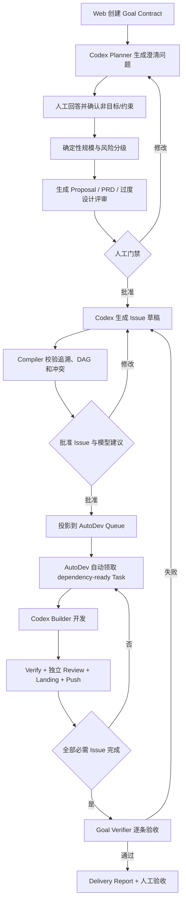
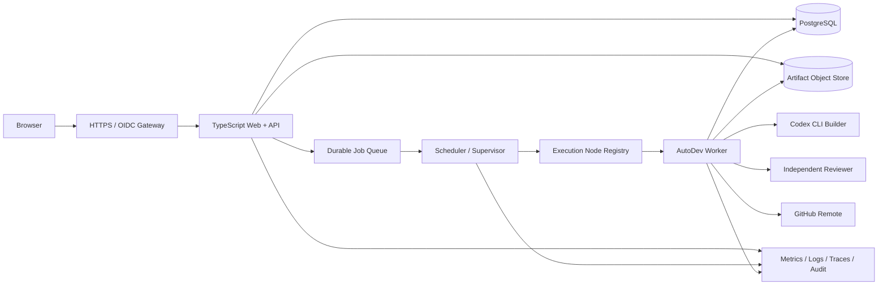

# AI Dev Harness Production V1 方案

## 1. 结论与生产范围

第一阶段不再定义为“本地 CLI MVP”，而定义为：

> 面向单个组织内部研发团队、可同时管理多个 Git 仓库和多个开发目标、通过 Web 完成
> 需求澄清与人工门禁、由受控执行节点自动完成开发和验证的生产版本。

“第一阶段可投入生产”意味着通过本方案的发布门槛后，可以用于真实内部项目；不意味着
立即成为面向公网的多租户 SaaS。

### 第一阶段包含

- 单组织、多项目、多仓库。
- Web 端 Goal 创建、AI 澄清、方案和 Issue 审批。
- Codex Planner 的结构化澄清、规格和 Issue 草稿。
- 可审计的模型路由和人工覆盖。
- AutoDev 执行、Worktree、验证、独立评审、恢复和 Landing。
- 任务级 Commit，以及项目策略明确允许后的远程分支 Push。
- 顶层 Goal Verifier 和 Delivery Report。
- OIDC/SSO、RBAC、审计日志、密钥引用和安全策略。
- PostgreSQL 权威状态、对象存储 Artifact、备份和恢复。
- 生产监控、告警、健康检查、迁移与回滚。

### 第一阶段不包含

- 多租户计费和外部客户自助注册。
- 跨组织协作和模型市场。
- 自动发布生产业务系统。
- 通用工作流拖拽编排器。
- 任意用户自定义 Shell、Webhook 或凭证脚本。
- 用 TypeScript 重写 AutoDev 执行核心。

## 2. 用户与权限

| 角色 | 核心权限 |
|---|---|
| Organization Owner | 配置组织、执行节点、模型策略、凭证引用和全局安全策略 |
| Project Admin | 接入仓库、设置基线分支、验证命令、Push/Landing 策略和成员 |
| Approver | 批准目标、范围、Helpful 例外、Issue DAG 和高风险恢复 |
| Operator | 启动、暂停、恢复运行，查看证据；不能修改批准后的合同 |
| Viewer | 只读查看目标、运行、证据和交付报告 |

权限由服务端逐请求校验。前端隐藏按钮不能代替授权。所有审批和高风险操作必须保存 actor、
reason、时间、对象版本和请求 ID。

## 3. 完整使用流程



### 需求在哪里澄清

需求澄清发生在 TypeScript 控制面的 Goal Workspace：

1. Goal Contract 保存问题、结果、验收标准、非目标和约束。
2. Codex Planner 以只读、全新会话运行，只读取当前 Goal 的上下文包。
3. Planner 使用 JSON Schema 输出已知事实、不确定项和高价值问题。
4. 人工在 Web 回答；业务决定不能由模型自动批准。
5. 确定性规则基于答案完成 S/M/L/XL 和风险分级。

### Issue 在哪里拆分

Issue 拆分也发生在 TypeScript 控制面：

1. Codex 根据已批准 PRD 生成 `issue-drafts`。
2. Compiler 证明需求覆盖、验收覆盖、依赖无环和冲突安全。
3. 每个 Issue 生成无上下文 Prompt、模型能力和推理强度。
4. 人工批准后才进入 AutoDev Queue。

### 如何自动领取

TypeScript Harness 不复制 Queue claim：

- TypeScript 负责把批准合同投影到 AutoDev 并启动一个受预算限制的 Supervisor。
- AutoDev `run-loop` 负责原子 claim、lease、依赖就绪、容量和 Worktree。
- TypeScript 订阅或轮询机器可读状态，同步 Run、Evidence 和 Goal 状态。
- 暂停只停止领取新任务，正在验证或 Landing 的任务默认安全排空。

## 4. 生产架构



### TypeScript 控制面

建议保持一个代码库、三个可独立部署进程：

```text
Web/API Process
  页面、HTTP API、认证、审批、Goal/Spec/Issue 应用服务

Scheduler Process
  durable job、Supervisor、AutoDev 状态同步、超时和 reconciliation

Execution Gateway
  受控启动 AutoDev/Codex 进程，最小环境变量，输出脱敏和 Artifact 上传
```

共享领域包只保存状态机、合同 Schema、授权策略和业务规则。Web Handler、数据库 ORM、
AutoDev CLI 和 Codex CLI 都是适配器，不能成为领域真相。

### AutoDev 执行面

保留 AutoDev 的：

- dependency-ready Queue。
- Worktree 隔离和运行预算。
- Builder、Verify、独立 Review。
- 重试、恢复、失败熔断。
- Git checkpoint、串行 Landing 和通知。

不得把七阶段逻辑继续堆入 AutoDev 的 `controller.py` 或 `web.py`。

## 5. 数据与 Artifact

PostgreSQL 是生产权威状态，至少包含：

- Organization、User、RoleBinding。
- Project、Repository、ExecutionNode。
- Goal、AcceptanceCriterion、Clarification、Decision。
- Classification、SpecRevision、ScopeApproval、HumanException。
- Issue、IssueDependency、ModelRecommendation、ExecutionWave。
- QueueProjection、Run、WorkerLease、Review、Evidence。
- GoalVerification、DeliveryReport、AuditEvent。
- CredentialReference、ModelProfile、PolicyRevision。

大文本、Prompt、日志、测试输出和报告存入对象存储；数据库保存 digest、大小、媒体类型、
位置、创建者和保留策略。Artifact 必须不可变，修订产生新版本，禁止覆盖历史证据。

所有写操作使用：

- 乐观版本号。
- Idempotency Key。
- Outbox/Inbox 事件模式。
- 唯一约束和显式状态转换。

## 6. Codex 与模型路由

### Codex Planner

- 使用 `codex exec` 非交互模式。
- 只读 Sandbox、每次新会话。
- Prompt 由当前 Goal Artifact 构造，不允许全局仓库扫描。
- 使用 `--output-schema` 产生结构化结果。
- 输出只能形成草稿，必须经过确定性校验和必要人工门禁。

### Codex Builder

- 由 AutoDev 在独立 Worktree 启动。
- 使用 workspace-write 和项目限定命令权限。
- 从标准输入读取单个 Issue 的自包含 Prompt。
- 每个 Issue 新会话。
- 真实测试、Review、Commit、Push 和 Landing 受项目策略控制。

### Model Router

Issue 只保存能力等级与推理强度：

```text
cost_optimized / low
general_coding / medium
advanced_coding / high
frontier / highest
```

运行时配置把它们映射到本机 AutoDev Builder alias。模型名称和账号配置不能写入 Issue。
高风险任务不能静默降级；fallback、人工覆盖和最终选择必须审计。

### AutoDev 0.4.16 兼容性门禁

当前运行时能读取 `preferred_builder`，但 `queue propose` CLI 不能设置它。生产前必须满足
以下其一：

1. 获得授权并增加带校验、锁和审计的任务级 Builder 参数。
2. 使用 AutoDev 提供方发布的正式 Queue Import/API。

临时按单任务生成默认 Builder 配置只能用于开发验证，不能作为生产并行自动切模方案。
TypeScript 禁止直接编辑 Queue YAML。

## 7. GitHub、Commit 和 Push

每个批准 Issue 在独立 Worktree 和分支开发。成功路径必须留下：

- Builder 变更摘要。
- Verify 命令和结果。
- 独立 Review 结论。
- Commit SHA。
- 远程分支和 Push receipt。
- Landing/PR 状态。

项目接入时显式选择：

- `push_disabled`：只产生本地候选，适用于早期试运行。
- `push_branch`：自动推送 Issue 分支，不自动合并。
- `push_and_open_pr`：推送后创建 PR，合并仍受门禁。

第一阶段禁止自动直接推送或合并受保护主分支。GitHub 凭证由 Secret Manager 注入，
仅授予目标仓库所需权限，不写入 YAML、数据库明文或日志。

## 8. 安全设计

### 身份与请求安全

- OIDC/SSO，短会话和安全 Cookie。
- 服务端 RBAC、项目级授权、CSRF 防护和内容安全策略。
- API 限流、请求大小限制和严格输入 Schema。
- 审批使用对象版本，防止批准过期合同。

### 执行安全

- 执行节点必须注册、健康且具备明确容量。
- 每个 Run 使用独立 Worktree；高风险场景使用容器或受控虚拟机。
- 外部写入、网络、Push 和通知由策略逐项允许。
- 不向 Builder 暴露控制面数据库、OIDC Token 或无关项目凭证。
- 命令使用参数数组，禁止把模型输出拼接进 Shell。
- Prompt、日志和 Artifact 做密钥检测与脱敏。
- 全局 Stop、项目 Stop、预算和失败熔断。

### 供应链

- 锁定依赖并生成 SBOM。
- 依赖漏洞、许可证和镜像扫描。
- 构建产物签名和来源证明。
- AutoDev Proprietary 授权范围在生产前书面确认。

## 9. 可靠性和恢复

- Scheduler 使用数据库 lease 和 heartbeat，单任务只有一个有效 owner。
- 进程崩溃后先 reconciliation，再决定恢复或阻塞。
- 状态变更和 Outbox 在同一事务提交。
- Artifact 上传使用 digest 去重和完成 receipt。
- 数据库自动备份，定期执行恢复演练。
- 数据迁移向前兼容，部署采用 expand/migrate/contract。
- 发布支持上一版本快速回滚；正在运行任务默认排空。

建议第一阶段目标：

| 指标 | 目标 |
|---|---|
| 控制面月可用性 | 99.5% |
| 普通 API p95 | 500 ms 内，不含模型/执行任务 |
| Web 状态新鲜度 | Run 变化 5 秒内可见 |
| Queue 重复执行 | 0 个未经 reconciliation 的重复 Run |
| RPO | 15 分钟 |
| RTO | 4 小时 |
| 审计保留 | 至少 180 天 |

## 10. 可观测性

所有请求和异步任务贯穿 `request_id`、`goal_id`、`issue_id`、`run_id`：

- 指标：Queue 深度、等待时间、执行时长、成功率、模型路由、token/成本、失败分类。
- 日志：结构化、脱敏、带 trace ID。
- Trace：Web → API → Scheduler → AutoDev → Codex/Reviewer → Git。
- 审计：审批、策略变更、凭证引用、Push、恢复和失败预算重置。
- 告警：调度停滞、Worker 失联、失败率、队列积压、数据库/对象存储异常。

Dashboard 显示业务状态，监控系统负责基础设施告警；两者不能混为一套真相。

## 11. Web 生产要求

Web 不是简单只读 Dashboard，而是生产控制面：

- Goal 创建和澄清问答。
- Proposal、PRD、过度设计和 Helpful 例外审批。
- Issue DAG、冲突和模型路由预览。
- 执行启动、暂停、恢复和失败处理。
- Run 时间线、测试、Review、Commit 和 Push 证据。
- Goal Verification 和 Delivery Report。

具体页面和交互见 [Web UI 交互设计说明](web-ui-design.md)。

## 12. 测试策略

### 确定性测试

- 领域状态机、Schema、权限、DAG、冲突和 Model Router 单元测试。
- PostgreSQL 事务、Outbox、lease、幂等和迁移集成测试。
- fake Codex、fake AutoDev、fake GitHub 契约测试。
- 真实 AutoDev 0.4.16 的兼容性测试套件。

### Web 集成测试

以浏览器完成以下主路径：

1. 创建 Goal，提交 AI 澄清答案。
2. 审批最小范围和 Helpful 例外。
3. 审查、修改和批准 Issue DAG 与模型建议。
4. 启动执行，观察自动领取、模型路由、测试、Review 和 Push。
5. 模拟失败、暂停、恢复和重新执行。
6. 运行 Goal Verifier，查看成功或回流。

覆盖键盘操作、窄屏、错误状态、无权限、重复提交和网络重连。

### 真实试运行

- 先在隔离测试仓库运行。
- 再选择一个低风险内部项目做 canary。
- 生产发布前连续 12 小时无 P0/P1 问题。
- 至少完成一次数据库恢复、Worker 失联和 Stop 演练。

## 13. Production V1 发布门槛

以下条件全部满足才可以投入生产：

- 核心七阶段主路径和失败回流均通过浏览器 E2E。
- OIDC、RBAC、CSRF、审计和密钥注入通过安全评审。
- AutoDev 测试基线和授权范围已取得。
- 任务级模型路由有正式受支持的写入接口。
- 生产依赖和镜像不存在未豁免的 Critical/High 漏洞。
- Commit、Push、Review 和 Landing 证据可追溯。
- 数据迁移、备份恢复、回滚和 Stop 演练通过。
- 监控、告警、运行手册和 on-call 责任人已就绪。
- Canary 项目通过顶层 Goal Verifier，且没有未披露阻塞。
- P0/P1 缺陷为零；P2 缺陷有负责人和规避方案。

没有任何方案能在开发前“保证”零故障。这里的可生产性由上述可验证门槛、canary 和恢复
能力保证，而不是由“所有 Issue 已完成”这一状态保证。
