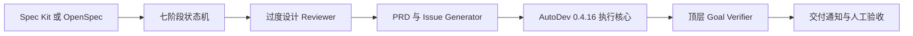

# 开源项目与本地 AutoDev 评估

## 1. 评估口径

本评估围绕七阶段 AI 开发 Harness：

1. 目标定义
2. 自适应澄清
3. 最小方案与过度设计评审
4. 产出规格
5. Issue 拆分
6. 调度执行
7. 集成交付

GitHub Star 数统计于 **2026-07-31**。Star 会持续变化，`k` 为页面显示的约数，选型时应重新核对项目主页。

## 2. 项目评估表

| 项目 | GitHub Star | 主要覆盖环节 | 直接使用建议 | 许可证 |
|---|---:|---|---|---|
| [Kandev](https://github.com/kdlbs/kandev) | 516 | Web UI、人工审批、多模型工作流、并行任务、Worktree 隔离、代码评审 | 内部 Harness 可直接试用或二开；需要补 PRD、过度设计评审、Issue DAG 自动调度和最终目标验收 | AGPL-3.0 |
| [GitHub Spec Kit](https://github.com/github/spec-kit) | 123.5k | 澄清、规格、技术方案、任务拆分、转 GitHub Issues、实现、收敛检查 | 最适合作为七阶段流程的前半段；通过扩展增加过度设计评审和人工门禁 | MIT |
| [OpenSpec](https://github.com/Fission-AI/OpenSpec) | 62.3k | Explore、Proposal、Spec、Design、Tasks、Apply、Verify | 适合作为 Spec Kit 的轻量替代，尤其适合已有代码库 | MIT |
| [OpenHands](https://github.com/OpenHands/OpenHands) | 82.6k | Agent Server、沙箱、Web UI、自动化、多 Agent 后端 | 适合作为自有 Harness 的执行基础设施；需要自行实现七阶段状态机和 Issue 调度 | MIT；企业目录例外 |
| [Task Master](https://github.com/eyaltoledano/claude-task-master) | 27.9k | PRD 转任务、依赖关系、复杂度分析、下一任务选择、MCP | 内部工具可直接集成；商业闭源或托管产品应谨慎使用代码 | MIT + Commons Clause |
| [BMAD Method](https://github.com/bmad-code-org/BMAD-METHOD) | 48.1k | 需求分析、PRD、架构、开发就绪检查、Story 开发 | 适合复用工作流、Prompt 和模板；完整流程可能偏重 | MIT |
| 本地 AutoDev Harness 0.4.16 | — | 任务审批、依赖就绪队列、串并行开发、Worktree、验证、独立评审、失败恢复、Dashboard、通知 | **建议作为本项目的执行核心继续演进，不建议重写**；需要补齐阶段 1～4 和顶层目标验收 | Proprietary |

## 3. 本地 AutoDev Harness 0.4.16 评估

### 3.1 评估对象

本地目录：

```text
/Users/onthewayli/harness/autodev-harness-0.4.16
```

实际运行版本：

```text
autodev 0.4.16
```

该目录是一次性源码分享包。根据 `START_HERE.md`，它不包含 Git 历史、内部记忆和测试；`pyproject.toml` 将许可证声明为 `LicenseRef-Proprietary`。

### 3.2 总体结论

AutoDev 不是七阶段 Harness 的替代品，而是其中相对成熟的**执行、验证和恢复底座**。它已经解决了阶段六的大部分工程问题，也具备阶段五和阶段七的关键基础。

推荐定位：

> 七阶段流程负责决定“为什么做、做什么、做到什么程度”；AutoDev 负责“如何安全执行、验证、评审、恢复和落地”。

不建议为了采用其他开源项目而重写 AutoDev 已有的执行能力。更合适的方案是在其上游增加规格层，在其下游增加目标级验收层。

### 3.3 七阶段覆盖情况

符号说明：

- `●`：已有较强原生能力
- `◐`：部分覆盖，需要扩展
- `○`：基本缺失

| 阶段 | 覆盖度 | 已有能力 | 主要缺口 |
|---|:---:|---|---|
| 1. 目标定义 | ◐ | Queue Task 支持 `goal`、`acceptance`、`source_refs` | 不负责主动访谈、识别非目标和形成顶层 Goal Contract |
| 2. 自适应澄清 | ○ | 可以人工编辑任务后再批准 | 没有根据规模、风险自动选择 Goal Brief、Mini PRD 或完整 PRD 的机制 |
| 3. 最小方案与过度设计评审 | ◐ | 有 Direction Review、独立 Evaluator 和人工批准门禁 | 没有 `Required / Helpful / Speculative` 分类，也没有删除过度设计和人工例外记录 |
| 4. 产出规格 | ○ | 能读取治理文档和任务 Source References | 不生成 Goal Brief、PRD、架构方案、迁移或回滚文档 |
| 5. Issue 拆分 | ◐ | 支持任务提议、批准、依赖、验收标准、验证命令和 `preferred_builder` | 不会从 PRD 自动拆 Issue；没有为每个 Issue 自动给出模型能力、推理强度和开发 Prompt |
| 6. 调度执行 | ● | Dependency-ready 选择、1～3 个并行 Worker、Worktree 隔离、主机和 Provider 容量、串行 Landing、重试恢复 | 缺少基于预计修改文件和公共接口的执行前语义冲突分析 |
| 7. 集成交付 | ◐ | Verify Gate、独立 Review、Git Checkpoint、Direction Review、通知、失败阻断 | 完成语义仍主要围绕 Task/Queue；缺少独立的顶层 Goal Verifier 对原始目标逐条验收 |

### 3.4 已有优势

#### 安全执行

- 每个 Run 使用独立 Git Worktree。
- Builder 和 Evaluator 默认要求不同 Agent。
- Evaluator 可配置为只读且每次使用新会话。
- 外部写入、Push 和通知默认受策略控制。
- 支持 STOP 文件、运行预算、失败熔断和人工恢复。

#### 并行与容量管理

- 依赖未完成的任务不会被领取。
- 同一项目可以运行多个隔离 Worker。
- 主机级 Broker 限制总 Worker、Provider 和独占资源。
- Candidate Landing 串行执行，并带恢复 Ledger。
- 多项目可以共享机器容量而不混合各自队列和状态。

#### 验证与可追溯性

- Task 保存验收标准和真实验证命令。
- Builder 后执行确定性 Verify。
- Verify 后再执行独立模型 Review。
- 任务契约被修改时会失败关闭。
- 保存 Run、事件、Artifact、Review、Git Commit 和队列状态证据。
- 支持文件、PostgreSQL Shadow 和 Database 权威模式的渐进迁移。

#### 运维与人工介入

- 提供 CLI、只读 Dashboard、Doctor 和 Registry。
- 支持人工批准、阻塞、恢复和带审计说明的失败预算重置。
- 失败 Candidate 可以在新 Worktree 中恢复，不必从头开始。
- 支持飞书、钉钉等通知适配层和 Dry-run 模式。

### 3.5 风险与限制

#### 缺少可验证的测试资产

分享包明确不包含测试和 Git 历史。虽然源码规模和功能较完整，但当前目录无法独立证明所有行为已经通过原项目测试。正式作为新 Harness 基线前，应取得对应版本的测试套件或建立新的回归测试。

#### 关键模块过于集中

- `autodev/controller.py` 约 4,852 行。
- `autodev/web.py` 约 4,073 行。

控制器同时承担执行、重试、队列、Git、验证、评审和 Landing 协调；Web 模块同时承担数据收集、文件/数据库投影、HTML 渲染和 HTTP 服务。继续增加七阶段能力时，不应直接堆入这两个文件，应先提取应用服务和阶段接口。

#### Dashboard 目前主要用于只读观测

现有 Dashboard 适合展示 Run、Worker、容量、队列和 Artifact，但七阶段需要的方案审批、过度设计例外、PRD 审批和最终目标验收尚未形成交互式 Web Gate。

#### 任务模型尚未等同于 Issue 开发合同

已有 Task Schema 能表达 Goal、Acceptance、Verify 和 Dependencies，但还缺少：

- `non_goals`
- `requirement_refs`
- `expected_files`
- `completion_evidence`
- `development_prompt`
- `model_capability`
- `reasoning_effort`
- `human_exception`

#### 许可证限制

该分享包声明为 Proprietary。即使本地可读，也不能默认当作开源组件分发、改造后发布或用于对外托管。进一步复用前需要确认授权范围。

## 4. 推荐组合

### 4.1 推荐架构



### 4.2 组件选择

| 能力 | 推荐来源 |
|---|---|
| 需求澄清、规格和 PRD 模板 | Spec Kit；轻量场景可选 OpenSpec |
| 自适应七阶段状态机 | 在 `ai-dev-harness` 中自建 |
| 过度设计评审 | 自建结构化 Reviewer 和人工例外 Gate |
| PRD 到 Issue DAG | 自建转换层；可参考 Task Master 数据模型 |
| Agent 执行、Worktree、验证、Review、恢复 | 复用本地 AutoDev |
| Web UI | 先复用 AutoDev Dashboard 的观测能力，再新增独立审批 API/UI |
| 最终交付 | 在 AutoDev 后增加 Goal Verifier 和 Delivery Report |

### 4.3 最小改造顺序

1. 为七阶段建立独立状态模型和 Artifact Schema。
2. 接入 Spec Kit 或 OpenSpec，生成 Goal、Proposal 和 PRD。
3. 增加过度设计评审及人工例外记录。
4. 把 Approved PRD 转换为 AutoDev Queue Tasks。
5. 扩展任务字段，保存开发 Prompt、模型能力和推理强度。
6. AutoDev 完成全部任务后，运行独立 Goal Verifier。
7. Goal Verifier 通过后才生成 Delivery Report 和完成通知。

## 5. 选型结论

当前最优路线不是选择一个 GitHub 项目整体替换本地实现，而是：

> 使用 Spec Kit 或 OpenSpec 补齐前四阶段，保留 AutoDev 作为阶段五至阶段七的执行底座，再新增过度设计评审和顶层目标验收。

只有在必须获得多用户交互式 Web 控制台、ACP 生态或许可更宽松的可分发执行层时，才进一步评估用 Kandev 或 OpenHands 替换部分能力。
