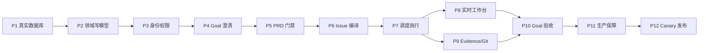

# AI Dev Harness V1 交付执行路线图

> 更新日期：2026-08-04
> 目标：从当前工作台原型推进到可供单个组织内部研发团队使用的 Production V1。
> 关联文档：[Production V1 方案](production-v1-plan.md)、[Web UI 设计](web-ui-design.md)、
> [V1 数据与接口契约](web-ui-v1-data-api-contract.md)。

## 1. 当前结论

当前已完成的是“工作台读取竖切”：首屏信息架构、组件化页面、统一任务投影、
`GET /api/v1/workbench`、ETag/分页/筛选、PostgreSQL 读模型和 Demo/PostgreSQL 数据源切换。

它可以验证产品方向和读取架构，但还不是生产控制面，原因是以下闭环尚未完成：

```text
Goal 写入 → AI 澄清 → 方案审批 → Issue 编译 → 调度执行
→ Evidence/Review/Git → Goal 验收 → Delivery Report
```

从现在到 Production V1 还剩：

- **12 个执行阶段**；
- **66 个可勾选执行项**；
- 每项均附带一条可脱离聊天上下文执行的开发提示词；
- 归并为 **4 个里程碑**；
- 下一步是 **P1：真实 PostgreSQL 数据闭环**。

阶段数量是交付结构，不是工期估算。工期需要在团队人数、AutoDev 接口授权、部署环境和
OIDC 提供方确定后单独排期。

## 2. 状态说明

| 标记 | 含义 |
|---|---|
| `[x]` | 已完成并有代码或测试证据 |
| `[ ]` | 尚未完成 |
| `Gate` | 未通过前不能进入下一里程碑 |

### 2.1 独立提示词的自动交付协议

下面每条“开发提示词”都可在没有聊天上下文时单独交给开发 Agent。Agent 必须执行本协议：

1. 工作区固定为 `/Users/onthewayli/harness/ai-dev-harness`。先查找并完整阅读适用的
   `AGENTS.md`、本路线图、关联设计/契约和目标代码；以仓库现状为准，不假设聊天背景。
2. 项目前期采用单一 Git 仓库；`prototype/web-ui` 是根仓库内的普通目录，禁止创建嵌套 `.git`、
   子模块或独立子仓库。Git 操作不得依赖当前目录；禁止使用裸 `git status`、`git commit`、
   `git push origin main`，一律使用根仓库绝对路径和 `git -C`。

   | 仓库 | 绝对路径 | 负责内容 |
   |---|---|---|
   | 统一根仓库 | `/Users/onthewayli/harness/ai-dev-harness` | 根目录、`docs/`、`prototype/web-ui/`、数据库代码、迁移、测试和路线图进度提交 |

3. 开始修改前，对统一根仓库执行以下预检；命令中的路径必须写成上表的绝对路径，不能用 `.`、
   相对路径或仅靠 `cd` 后的当前目录。同时执行 `node scripts/check-single-git-repository.mjs`，发现
   任何嵌套 Git 元数据都必须停止。

   ```bash
   git -C /Users/onthewayli/harness/ai-dev-harness rev-parse --show-toplevel
   git -C /Users/onthewayli/harness/ai-dev-harness status --short --branch
   git -C /Users/onthewayli/harness/ai-dev-harness remote get-url origin
   git -C /Users/onthewayli/harness/ai-dev-harness fetch origin main
   git -C /Users/onthewayli/harness/ai-dev-harness rev-list --left-right --count origin/main...main
   ```

   `rev-parse` 结果必须等于预期绝对路径，当前分支必须为 `main`，`origin` 必须存在；开始实现前
   `rev-list` 的左右计数必须均为 `0`。任何其他结果都先停止并报告；不得把用户已有提交或外部
   仓库的历史顺带 push。

4. 只修改、暂存本环节文件，不覆盖、暂存或清理用户已有改动。先写失败测试或明确可复现的失败检查，
   再实现最小闭环；执行相关单测、集成测试、类型检查、Lint 和构建。涉及外部服务时必须验证真实集成，
   不能只用 Mock 宣称完成。

5. 测试全部通过后，在统一根仓库的 `main` 提交。暂存、检查、提交和 push 的每条命令都必须带
   根仓库绝对 `git -C` 路径。

   ```bash
   git -C /Users/onthewayli/harness/ai-dev-harness add -- <本环节文件...>
   git -C /Users/onthewayli/harness/ai-dev-harness diff --cached --name-only
   git -C /Users/onthewayli/harness/ai-dev-harness commit -m "<说明性提交信息>"
   git -C /Users/onthewayli/harness/ai-dev-harness push origin HEAD:main
   git -C /Users/onthewayli/harness/ai-dev-harness fetch origin main
   test "$(git -C /Users/onthewayli/harness/ai-dev-harness rev-parse HEAD)" = \
     "$(git -C /Users/onthewayli/harness/ai-dev-harness rev-parse origin/main)"
   ```

   push 命令退出码为零且本地 `HEAD` 等于更新后的 `origin/main`，才算实现推送成功。禁止 force-push；
   若远端缺失、权限不足、远端拒绝或外部前置条件缺失，停止并报告，不得改路线图完成状态。

6. 实现成功推送后，将本文件对应条目从 `[ ]` 改为 `[x]`，并追加
   `（已完成：YYYY-MM-DD；实现提交：<repo>@<sha>）`。路线图只在根仓库创建独立进度提交，并用根仓库
   绝对路径完成 push 与远端 SHA 校验：

   ```bash
   git -C /Users/onthewayli/harness/ai-dev-harness add -- \
     docs/v1-delivery-execution-roadmap.md
   git -C /Users/onthewayli/harness/ai-dev-harness diff --cached --name-only
   git -C /Users/onthewayli/harness/ai-dev-harness commit -m "docs: mark <编号> complete"
   git -C /Users/onthewayli/harness/ai-dev-harness push origin HEAD:main
   git -C /Users/onthewayli/harness/ai-dev-harness fetch origin main
   test "$(git -C /Users/onthewayli/harness/ai-dev-harness rev-parse HEAD)" = \
     "$(git -C /Users/onthewayli/harness/ai-dev-harness rev-parse origin/main)"
   ```

7. 只有实现、测试、实现提交与远端 SHA 校验、路线图标记、路线图提交与远端 SHA 校验全部成功，才能
   宣布该环节“已完成”。最终报告必须列出测试结果、根仓库提交 SHA、push/校验结果、已知限制和下一项编号。

### 2.2 快捷复制提示词

每个执行项下方都有一个“快捷复制开发提示词”折叠区：

1. 点击标题展开提示词；
2. 点击 `text` 代码块右上角的复制按钮；
3. 将复制结果直接交给新的开发 Agent 执行。

Codex、GitHub 等支持代码块复制的 Markdown 渲染器会自动显示复制按钮；纯文本编辑器仍可手动
选择代码块内容。提示词默认折叠，以便优先浏览阶段、任务和完成状态。每条提示词都重复包含 Git
目录安全提醒；实际命令仍以第 2.1 的单仓库归属、绝对 `git -C`、push 和远端 SHA 校验模板为准。

### 2.3 模型与推理强度

每条提示词开头使用两档简易建议，格式统一为 English(中文)：

- `gpt-5.6-terra(均衡开发模型)` + `medium(中等)`：文档、UI、常规 Schema、测试配置和边界清晰的实现；
- `gpt-5.6-sol(深度开发模型)` + `high(高)`：安全、并发、事务、状态机、调度恢复和跨系统关键集成。

这是执行建议，不改变任务验收标准。若运行环境没有指定模型，应选择同等级替代；标记为
`high(高)` 的任务不得在未说明风险并获得确认时静默降低推理强度。

## 3. 已完成基线（P0）

- [x] 明确首屏核心问题：运行是否健康、最该处理什么、正在推进什么。
- [x] 将“待处理问题”合并进 `GlobalTask.attention`，避免问题与任务两套列表。
- [x] 完成桌面端工作台视觉优化与单页组件化。
- [x] 定义 `WorkbenchSnapshot`、`GlobalTask`、分页和错误契约。
- [x] 实现 `WorkbenchApi` 与 `GET /api/v1/workbench`，替换浏览器 Mock。
- [x] 实现 ETag、304、查询校验、筛选、稳定排序与游标分页。
- [x] 实现 PostgreSQL 读模型、迁移、Neon/Drizzle 读取和投影写入。
- [x] 实现 `auto | demo | postgres` 数据源选择和生产失败关闭策略。
- [x] 完成生产构建、Lint、类型检查和 16 项自动化测试。

单仓库合并前的历史代码基线：

```text
prototype/web-ui commit 5ae099c
root docs commit        ac233f2
```

## 4. 里程碑总览

| 里程碑 | 阶段 | 交付结果 | Gate |
|---|---|---|---|
| M1 数据与控制面基础 | P1～P3 | 真实数据库、领域写模型、身份权限 | 能安全创建并读取 Goal，所有写入可审计 |
| M2 规划与审批闭环 | P4～P6 | 澄清、PRD、Issue DAG 和模型建议 | Approved Issue 能稳定投影到执行队列 |
| M3 执行与证据闭环 | P7～P9 | AutoDev 调度、实时工作台、Evidence/Git | 单个真实 Issue 可自动执行并形成完整证据链 |
| M4 验收与生产发布 | P10～P12 | Goal Verifier、运维保障、Canary | Production V1 发布门槛全部通过 |

## 5. P1：真实 PostgreSQL 数据闭环（下一步）

目标：让当前页面在真实数据库上运行，并把数据库接入变成可重复验证的工程能力。

- [x] **P1-01** 确定开发、测试、预发布三套 PostgreSQL 实例和 Secret 注入方式。（已完成：2026-08-04；实现提交：ai-dev-harness@653d290f0d23e37879341b20f9be30cf02a64ebf）

<details>
<summary>快捷复制开发提示词 P1-01 · gpt-5.6-terra(均衡) · medium(中等)</summary>

```text
Model: gpt-5.6-terra(均衡开发模型)
Reasoning: medium(中等)

Git 操作必须按第 2.1 使用代码所属仓库的绝对路径和 `git -C`；禁止依赖当前目录执行裸 `git commit` 或 `git push`。push 必须使用 `git -C <代码所属仓库绝对路径> push origin HEAD:main` 并校验远端 SHA。

工作区固定为 `/Users/onthewayli/harness/ai-dev-harness`；先读取 `docs/v1-delivery-execution-roadmap.md` 第 2.1 自动交付协议。你正在无上下文独立执行 AI Dev Harness 的 P1-01。先阅读 P1、
`docs/production-v1-plan.md` 和 `prototype/web-ui/README.md`。盘点现有 Neon/Drizzle 配置，
为开发、测试、预发布定义互相隔离的 PostgreSQL 实例、数据库/角色权限、Secret 名称、注入和
轮换方式，提供不含真实凭证的环境变量模板及可执行连通性检查；不得把 Secret 写入 Git、日志或
客户端。用自动化配置测试验证环境映射和缺失 Secret 时失败关闭。完成后执行全部相关测试，并严格
按第 2.1 协议自动 commit、push 到 `main`，再把 P1-01 标记为 `[x]（已完成）`并推送路线图。
```

</details>

- [x] **P1-02** 在开发数据库执行 `drizzle-postgres` 迁移，并记录 migration receipt。（已完成：2026-08-04；实现提交：ai-dev-harness@8948cf541695635e7465b936b756120f73a9e098）

<details>
<summary>快捷复制开发提示词 P1-02 · gpt-5.6-terra(均衡) · medium(中等)</summary>

```text
Model: gpt-5.6-terra(均衡开发模型)
Reasoning: medium(中等)

Git 操作必须按第 2.1 使用代码所属仓库的绝对路径和 `git -C`；禁止依赖当前目录执行裸 `git commit` 或 `git push`。push 必须使用 `git -C <代码所属仓库绝对路径> push origin HEAD:main` 并校验远端 SHA。

工作区固定为 `/Users/onthewayli/harness/ai-dev-harness`；先读取 `docs/v1-delivery-execution-roadmap.md` 第 2.1 自动交付协议。你正在无上下文独立执行 P1-02。进入工作区并先阅读本路线图第 2.1、
P1、`prototype/web-ui/drizzle-postgres.config.ts`、`db/postgres-schema.ts` 和已有迁移。
在 P1-01 定义的开发数据库上从空库执行迁移，设计可审计的 migration receipt（环境、迁移版本、
时间、结果，不含连接串），验证重复执行幂等、Schema 与迁移无漂移、失败不会被当作成功。补齐
自动化验证和运行文档。完成并测试通过后，按第 2.1 自动提交和 push 到各自 `main`，再用真实提交
SHA 将 P1-02 标记为 `[x]（已完成）`并提交、push 路线图。
```

</details>

- [x] **P1-03** 写入测试投影，验证 `WORKBENCH_DATA_SOURCE=postgres` 下 SSR 和 API。（已完成：2026-08-04；实现提交：ai-dev-harness@3f62e9ad7852a835c5b45cb61d5dafdc5a7585d2）

<details>
<summary>快捷复制开发提示词 P1-03 · gpt-5.6-terra(均衡) · medium(中等)</summary>

```text
Model: gpt-5.6-terra(均衡开发模型)
Reasoning: medium(中等)

Git 操作必须按第 2.1 使用代码所属仓库的绝对路径和 `git -C`；禁止依赖当前目录执行裸 `git commit` 或 `git push`。push 必须使用 `git -C <代码所属仓库绝对路径> push origin HEAD:main` 并校验远端 SHA。

工作区固定为 `/Users/onthewayli/harness/ai-dev-harness`；先读取 `docs/v1-delivery-execution-roadmap.md` 第 2.1 自动交付协议。你正在无上下文独立执行 P1-03。先阅读第 2.1、P1、V1 接口契约及
`prototype/web-ui/app/workbench/server/`。向已迁移的开发数据库写入独立测试 scope，启动
`WORKBENCH_DATA_SOURCE=postgres`，验证首页 SSR 和 `GET /api/v1/workbench` 的 revision、统计、
筛选、分页、ETag 与 `x-workbench-source=postgres` 一致；测试结束清理测试 scope，不破坏共享数据。
保存可复现命令和脱敏验证证据。全部测试通过后，按第 2.1 自动 commit/push `main`，再将 P1-03
标记为 `[x]（已完成）`并提交、push 路线图。
```

</details>

- [x] **P1-04** 增加临时测试数据库集成测试，覆盖迁移、写投影、筛选、分页和空投影错误。（已完成：2026-08-04；实现提交：ai-dev-harness@9c64f2987d7ff1e4693ffee9cd01f593d09770b3）

<details>
<summary>快捷复制开发提示词 P1-04 · gpt-5.6-sol(深度) · high(高)</summary>

```text
Model: gpt-5.6-sol(深度开发模型)
Reasoning: high(高)

Git 操作必须按第 2.1 使用代码所属仓库的绝对路径和 `git -C`；禁止依赖当前目录执行裸 `git commit` 或 `git push`。push 必须使用 `git -C <代码所属仓库绝对路径> push origin HEAD:main` 并校验远端 SHA。

工作区固定为 `/Users/onthewayli/harness/ai-dev-harness`；先读取 `docs/v1-delivery-execution-roadmap.md` 第 2.1 自动交付协议。你正在无上下文独立执行 P1-04。先阅读第 2.1、P1、现有 PostgreSQL
Repository/Writer 和测试约定。实现可在本地与 CI 自动创建、迁移、隔离并销毁的临时 PostgreSQL
测试库；写真实数据库集成测试覆盖投影替换、revision 一致性、目标/状态/attention 筛选、游标分页、
空投影、无效 cursor 和连接失败。测试必须证明事务边界，不能用 fake store 替代。通过类型检查、
Lint、构建和全量测试后，按第 2.1 自动 commit/push `main`，再标记 P1-04 为 `[x]（已完成）`并
提交、push 路线图。
```

</details>

- [x] **P1-05** 增加 `/health/ready` 数据库检查和生产环境禁止 Demo 回退的部署校验。（已完成：2026-08-04；实现提交：ai-dev-harness@3967572874bc0c612c0579f4f094d844417cb3ab）

<details>
<summary>快捷复制开发提示词 P1-05 · gpt-5.6-sol(深度) · high(高)</summary>

```text
Model: gpt-5.6-sol(深度开发模型)
Reasoning: high(高)

Git 操作必须按第 2.1 使用代码所属仓库的绝对路径和 `git -C`；禁止依赖当前目录执行裸 `git commit` 或 `git push`。push 必须使用 `git -C <代码所属仓库绝对路径> push origin HEAD:main` 并校验远端 SHA。

工作区固定为 `/Users/onthewayli/harness/ai-dev-harness`；先读取 `docs/v1-delivery-execution-roadmap.md` 第 2.1 自动交付协议。你正在无上下文独立执行 P1-05。先阅读第 2.1、P1、仓库工厂、API
错误协议和部署配置。实现轻量 `/health/ready`：检查配置和数据库可读性但不泄露 Secret/内部错误；
生产/预发布环境必须显式为 `postgres`，缺少 `DATABASE_URL` 或投影不可用时 readiness 失败且禁止
Demo 回退。覆盖 healthy、配置错误、连接失败和缺投影测试，并确认普通 API 返回结构化错误。
全部验证通过后，按第 2.1 自动 commit/push `main`，再标记 P1-05 为 `[x]（已完成）`并提交、
push 路线图。
```

</details>

- [x] **P1-06** 在 CI 中执行 migration drift、数据库集成测试和客户端 Secret 泄漏检查。（已完成：2026-08-04；实现提交：ai-dev-harness@a413f40731a2be71601632c8c1fabb5db73837a3）

<details>
<summary>快捷复制开发提示词 P1-06 · gpt-5.6-terra(均衡) · medium(中等)</summary>

```text
Model: gpt-5.6-terra(均衡开发模型)
Reasoning: medium(中等)

Git 操作必须按第 2.1 使用代码所属仓库的绝对路径和 `git -C`；禁止依赖当前目录执行裸 `git commit` 或 `git push`。push 必须使用 `git -C <代码所属仓库绝对路径> push origin HEAD:main` 并校验远端 SHA。

工作区固定为 `/Users/onthewayli/harness/ai-dev-harness`；先读取 `docs/v1-delivery-execution-roadmap.md` 第 2.1 自动交付协议。你正在无上下文独立执行 P1-06。先阅读第 2.1、P1、现有 npm scripts、
CI 配置和构建产物结构。新增 CI job：启动隔离 PostgreSQL、从空库迁移、检查 migration drift、运行
P1-04 集成测试、生产构建，并扫描客户端产物不得出现连接串、Secret 名或数据库驱动服务端代码。
失败必须阻止合并，日志必须脱敏；提供本地等价命令。验证工作流语法和可执行性后，按第 2.1 自动
commit/push `main`，再标记 P1-06 为 `[x]（已完成）`并提交、push 路线图。
```

</details>

交付物：

- 可用的开发/测试 PostgreSQL；
- 可重复执行的迁移和测试数据初始化；
- PostgreSQL API 集成测试；
- 部署环境变量清单和数据库故障行为说明。

验收标准：

1. `x-workbench-source` 返回 `postgres`；
2. SSR 与 API 使用同一 scope/revision；
3. 数据库不可用时返回结构化 5xx，不静默展示 Demo；
4. CI 可以从空数据库完成 migrate → seed → test。

## 6. P2：核心领域写模型与事务边界

目标：建立控制面的权威状态，不再把工作台 JSON 当作业务事实源。

- [x] **P2-01** 定义 Organization、Project、Repository、Goal、AcceptanceCriterion 数据表和 Schema。（已完成：2026-08-04；实现提交：ai-dev-harness@55cb79a734b21734dd1572ac3f57eb7248847111）

<details>
<summary>快捷复制开发提示词 P2-01 · gpt-5.6-terra(均衡) · medium(中等)</summary>

```text
Model: gpt-5.6-terra(均衡开发模型)
Reasoning: medium(中等)

Git 操作必须按第 2.1 使用代码所属仓库的绝对路径和 `git -C`；禁止依赖当前目录执行裸 `git commit` 或 `git push`。push 必须使用 `git -C <代码所属仓库绝对路径> push origin HEAD:main` 并校验远端 SHA。

工作区固定为 `/Users/onthewayli/harness/ai-dev-harness`；先读取 `docs/v1-delivery-execution-roadmap.md` 第 2.1 自动交付协议。你正在无上下文独立执行 P2-01。先阅读第 2.1、P2、Production V1 数据
范围和 V1 接口契约。用领域术语定义 Organization、Project、Repository、Goal、AcceptanceCriterion
的 TypeScript Schema、PostgreSQL 表、主外键、租户隔离键、版本、时间戳和必要约束；区分权威写模型
与 Workbench 读模型。先写 Schema/迁移测试，再生成迁移并更新数据词典，不提前加入后续领域。
全量验证通过后，按第 2.1 自动 commit/push `main`，再标记 P2-01 为 `[x]（已完成）`并提交、
push 路线图。
```

</details>

- [x] **P2-02** 定义 Clarification、Decision、SpecRevision、Issue、IssueDependency 状态模型。（已完成：2026-08-04；实现提交：ai-dev-harness@a76c0e64054d6b878637126d3337df97ef301a5c）

<details>
<summary>快捷复制开发提示词 P2-02 · gpt-5.6-terra(均衡) · medium(中等)</summary>

```text
Model: gpt-5.6-terra(均衡开发模型)
Reasoning: medium(中等)

Git 操作必须按第 2.1 使用代码所属仓库的绝对路径和 `git -C`；禁止依赖当前目录执行裸 `git commit` 或 `git push`。push 必须使用 `git -C <代码所属仓库绝对路径> push origin HEAD:main` 并校验远端 SHA。

工作区固定为 `/Users/onthewayli/harness/ai-dev-harness`；先读取 `docs/v1-delivery-execution-roadmap.md` 第 2.1 自动交付协议。你正在无上下文独立执行 P2-02。先阅读第 2.1、P2、Goal/Issue 相关设计和
P2-01 产物。定义 Clarification、Decision、SpecRevision、Issue、IssueDependency 的领域对象、状态、
版本关系、不可变历史和 PostgreSQL 约束；依赖必须限定项目/Goal 边界并为 DAG 校验留接口。补齐迁移、
序列化和非法引用测试，不实现 UI。测试通过后，按第 2.1 自动 commit/push `main`，再标记 P2-02
为 `[x]（已完成）`并提交、push 路线图。
```

</details>

- [x] **P2-03** 定义 Run、Evidence、AuditEvent、OutboxEvent 和 IdempotencyRecord 基础表。（已完成：2026-08-04；实现提交：ai-dev-harness@633731d803f7c78cd75e161fb465b9dc52bb4ee9）

<details>
<summary>快捷复制开发提示词 P2-03 · gpt-5.6-terra(均衡) · medium(中等)</summary>

```text
Model: gpt-5.6-terra(均衡开发模型)
Reasoning: medium(中等)

Git 操作必须按第 2.1 使用代码所属仓库的绝对路径和 `git -C`；禁止依赖当前目录执行裸 `git commit` 或 `git push`。push 必须使用 `git -C <代码所属仓库绝对路径> push origin HEAD:main` 并校验远端 SHA。

工作区固定为 `/Users/onthewayli/harness/ai-dev-harness`；先读取 `docs/v1-delivery-execution-roadmap.md` 第 2.1 自动交付协议。你正在无上下文独立执行 P2-03。先阅读第 2.1、P2、可靠性/审计/Artifact
要求和前置 Schema。定义 Run、Evidence 元数据、AuditEvent、OutboxEvent、IdempotencyRecord 的表、
类型、索引、保留字段和唯一约束；大文本只存引用和 digest，审计事件禁止覆盖，幂等键明确作用域与
过期策略。补迁移及约束测试。全部通过后，按第 2.1 自动 commit/push `main`，再标记 P2-03 为
`[x]（已完成）`并提交、push 路线图。
```

</details>

- [x] **P2-04** 实现领域状态机、乐观版本号、唯一约束和显式状态转换。（已完成：2026-08-04；实现提交：ai-dev-harness@5f8a737f57501323036283681d1ded5381682f39）

<details>
<summary>快捷复制开发提示词 P2-04 · gpt-5.6-sol(深度) · high(高)</summary>

```text
Model: gpt-5.6-sol(深度开发模型)
Reasoning: high(高)

Git 操作必须按第 2.1 使用代码所属仓库的绝对路径和 `git -C`；禁止依赖当前目录执行裸 `git commit` 或 `git push`。push 必须使用 `git -C <代码所属仓库绝对路径> push origin HEAD:main` 并校验远端 SHA。

工作区固定为 `/Users/onthewayli/harness/ai-dev-harness`；先读取 `docs/v1-delivery-execution-roadmap.md` 第 2.1 自动交付协议。你正在无上下文独立执行 P2-04。先阅读第 2.1、P2、P2-01～03 模型和
所有业务 Gate。为 Goal、SpecRevision、Issue、Run 建立纯领域状态机，列出允许/禁止转换、守卫条件、
终态和版本递增；数据库写入使用 expectedVersion 与唯一约束防并发覆盖。先写表驱动失败测试，再实现
最小转换 API，不把规则散落在 Handler。全量测试通过后按第 2.1 自动 commit/push `main`，再标记
P2-04 为 `[x]（已完成）`并提交、push 路线图。
```

</details>

- [x] **P2-05** 实现 Repository/Application Service，HTTP Handler 不直接操作 ORM。（已完成：2026-08-04；实现提交：ai-dev-harness@c823d3f63ed98df9794326c6b6e85b294c4dcf89）

<details>
<summary>快捷复制开发提示词 P2-05 · gpt-5.6-sol(深度) · high(高)</summary>

```text
Model: gpt-5.6-sol(深度开发模型)
Reasoning: high(高)

Git 操作必须按第 2.1 使用代码所属仓库的绝对路径和 `git -C`；禁止依赖当前目录执行裸 `git commit` 或 `git push`。push 必须使用 `git -C <代码所属仓库绝对路径> push origin HEAD:main` 并校验远端 SHA。

工作区固定为 `/Users/onthewayli/harness/ai-dev-harness`；先读取 `docs/v1-delivery-execution-roadmap.md` 第 2.1 自动交付协议。你正在无上下文独立执行 P2-05。先阅读第 2.1、P2、当前 server 目录和
P2 状态机。设计端口/适配器边界：领域层不依赖 HTTP/Drizzle，Repository 封装持久化，Application
Service 编排授权前置、状态转换、事务和事件，Handler 只做协议映射。选择一个 Goal 写操作做纵向切片，
用内存与 PostgreSQL 契约测试证明实现一致。验证通过后按第 2.1 自动 commit/push `main`，再标记
P2-05 为 `[x]（已完成）`并提交、push 路线图。
```

</details>

- [x] **P2-06** 为写命令增加幂等、事务、Outbox 和状态机单元/集成测试。（已完成：2026-08-04；实现提交：ai-dev-harness@2bdaa39042fb6459d8d96cc21822e126bff43134）

<details>
<summary>快捷复制开发提示词 P2-06 · gpt-5.6-sol(深度) · high(高)</summary>

```text
Model: gpt-5.6-sol(深度开发模型)
Reasoning: high(高)

Git 操作必须按第 2.1 使用代码所属仓库的绝对路径和 `git -C`；禁止依赖当前目录执行裸 `git commit` 或 `git push`。push 必须使用 `git -C <代码所属仓库绝对路径> push origin HEAD:main` 并校验远端 SHA。

工作区固定为 `/Users/onthewayli/harness/ai-dev-harness`；先读取 `docs/v1-delivery-execution-roadmap.md` 第 2.1 自动交付协议。你正在无上下文独立执行 P2-06。先阅读第 2.1、P2、错误协议和 P2-05
纵向切片。为写命令统一实现 Idempotency-Key、expectedVersion、业务写入+Audit+Outbox 同事务提交、
重试后的相同响应和冲突错误；测试事务回滚、并发版本冲突、重复请求、Outbox 唯一投递和非法状态转换。
不启动真实异步副作用。全量测试通过后按第 2.1 自动 commit/push `main`，再标记 P2-06 为
`[x]（已完成）`并提交、push 路线图。
```

</details>

验收标准：任意 Goal/Issue 写入都能回答“谁、何时、基于哪个版本、为什么、产生了什么事件”。

## 7. P3：身份、授权与请求安全

目标：让控制面具备真实组织和项目边界。

- [x] **P3-01** 接入 OIDC/SSO，建立安全 Session、登录、登出和过期处理。（已完成：2026-08-04；实现提交：ai-dev-harness@a3c87cd47148d3680f397cc5c0eafed95a8d669a）

<details>
<summary>快捷复制开发提示词 P3-01 · gpt-5.6-sol(深度) · high(高)</summary>

```text
Model: gpt-5.6-sol(深度开发模型)
Reasoning: high(高)

Git 操作必须按第 2.1 使用代码所属仓库的绝对路径和 `git -C`；禁止依赖当前目录执行裸 `git commit` 或 `git push`。push 必须使用 `git -C <代码所属仓库绝对路径> push origin HEAD:main` 并校验远端 SHA。

工作区固定为 `/Users/onthewayli/harness/ai-dev-harness`；先读取 `docs/v1-delivery-execution-roadmap.md` 第 2.1 自动交付协议。你正在无上下文独立执行 P3-01。先阅读第 2.1、P3、Production V1 身份
要求和当前托管平台认证能力。选择并记录 OIDC/SSO 集成方式，实现服务端验证、短会话、安全 Cookie、
state/nonce/PKCE、登录登出、过期和回跳白名单；不在客户端保存 token。使用本地 fake IdP 契约测试
成功、过期、签名错误、重放和非法 returnTo。安全测试通过后按第 2.1 自动 commit/push `main`，再
标记 P3-01 为 `[x]（已完成）`并提交、push 路线图。
```

</details>

- [x] **P3-02** 实现 Owner、Project Admin、Approver、Operator、Viewer 的服务端 RBAC。（已完成：2026-08-04；实现提交：ai-dev-harness@9ee915898577f20d57b476655855b3657b1a405e）

<details>
<summary>快捷复制开发提示词 P3-02 · gpt-5.6-sol(深度) · high(高)</summary>

```text
Model: gpt-5.6-sol(深度开发模型)
Reasoning: high(高)

Git 操作必须按第 2.1 使用代码所属仓库的绝对路径和 `git -C`；禁止依赖当前目录执行裸 `git commit` 或 `git push`。push 必须使用 `git -C <代码所属仓库绝对路径> push origin HEAD:main` 并校验远端 SHA。

工作区固定为 `/Users/onthewayli/harness/ai-dev-harness`；先读取 `docs/v1-delivery-execution-roadmap.md` 第 2.1 自动交付协议。你正在无上下文独立执行 P3-02。先阅读第 2.1、P3、角色权限表和 P3-01
身份上下文。建立 RoleBinding、权限枚举和服务端 policy evaluator，覆盖组织/项目作用域、默认拒绝、
最小权限和角色变更审计；前端 action.available 只能展示服务端结果。用权限矩阵测试每个角色的读取、
审批和操作，重点测试越权。通过后按第 2.1 自动 commit/push `main`，再标记 P3-02 为
`[x]（已完成）`并提交、push 路线图。
```

</details>

- [x] **P3-03** 所有查询和统计按 Organization/Project/Goal 可见范围过滤。（已完成：2026-08-04；实现提交：ai-dev-harness@a36800cc99abed2fac261f12680f6d2f4b595ed4）

<details>
<summary>快捷复制开发提示词 P3-03 · gpt-5.6-sol(深度) · high(高)</summary>

```text
Model: gpt-5.6-sol(深度开发模型)
Reasoning: high(高)

Git 操作必须按第 2.1 使用代码所属仓库的绝对路径和 `git -C`；禁止依赖当前目录执行裸 `git commit` 或 `git push`。push 必须使用 `git -C <代码所属仓库绝对路径> push origin HEAD:main` 并校验远端 SHA。

工作区固定为 `/Users/onthewayli/harness/ai-dev-harness`；先读取 `docs/v1-delivery-execution-roadmap.md` 第 2.1 自动交付协议。你正在无上下文独立执行 P3-03。先阅读第 2.1、P3、Repository 查询接口、
Workbench 统计契约和 RBAC。把 actor visibility scope 作为每个读仓库的必填输入，在 SQL 层过滤 Goal、
Task 和 summary，禁止先全量读取再在客户端过滤；scope 不能来自未校验请求参数。构造两个组织、多个
项目的隔离集成测试，证明内容、total、统计和 ETag 均不泄漏。通过后按第 2.1 自动 commit/push
`main`，再标记 P3-03 为 `[x]（已完成）`并提交、push 路线图。
```

</details>

- [x] **P3-04** 增加 CSRF、输入 Schema、请求大小、限流和安全响应头。（已完成：2026-08-04；实现提交：ai-dev-harness@1201afecc95379ae204b58b42fe2e523077a410b）

<details>
<summary>快捷复制开发提示词 P3-04 · gpt-5.6-sol(深度) · high(高)</summary>

```text
Model: gpt-5.6-sol(深度开发模型)
Reasoning: high(高)

Git 操作必须按第 2.1 使用代码所属仓库的绝对路径和 `git -C`；禁止依赖当前目录执行裸 `git commit` 或 `git push`。push 必须使用 `git -C <代码所属仓库绝对路径> push origin HEAD:main` 并校验远端 SHA。

工作区固定为 `/Users/onthewayli/harness/ai-dev-harness`；先读取 `docs/v1-delivery-execution-roadmap.md` 第 2.1 自动交付协议。你正在无上下文独立执行 P3-04。先阅读第 2.1、P3、现有 API 错误协议和
部署运行时。为所有写请求实现同源/CSRF 保护、严格 Schema、未知字段拒绝、请求体大小上限和按 actor/
组织/接口限流；配置 CSP、frame、referrer 和 MIME 安全头，保持 API 错误不泄露内部信息。增加绕过、
超限和合法请求测试。全量验证通过后按第 2.1 自动 commit/push `main`，再标记 P3-04 为
`[x]（已完成）`并提交、push 路线图。
```

</details>

- [x] **P3-05** 增加越权、跨项目数量泄漏、重复提交和审计完整性测试。（已完成：2026-08-04；实现提交：ai-dev-harness@0753541e2e170ad40182aa7db37393b618c00d85）

<details>
<summary>快捷复制开发提示词 P3-05 · gpt-5.6-sol(深度) · high(高)</summary>

```text
Model: gpt-5.6-sol(深度开发模型)
Reasoning: high(高)

Git 操作必须按第 2.1 使用代码所属仓库的绝对路径和 `git -C`；禁止依赖当前目录执行裸 `git commit` 或 `git push`。push 必须使用 `git -C <代码所属仓库绝对路径> push origin HEAD:main` 并校验远端 SHA。

工作区固定为 `/Users/onthewayli/harness/ai-dev-harness`；先读取 `docs/v1-delivery-execution-roadmap.md` 第 2.1 自动交付协议。你正在无上下文独立执行 P3-05。先阅读第 2.1、P3 全部实现和测试设施。
建立安全回归套件，覆盖匿名访问、角色越权、跨组织 ID 猜测、分页 total/summary 泄漏、重复审批、
Idempotency-Key 跨用户复用、审计缺字段和被篡改历史；测试必须使用真实 Repository/数据库边界。
修复发现的问题并记录威胁覆盖。全套测试通过后按第 2.1 自动 commit/push `main`，再标记 P3-05
为 `[x]（已完成）`并提交、push 路线图。
```

</details>

**M1 Gate：** 用户能安全创建 Goal；数据库、权限和审计均有自动化证据。

## 8. P4：Goal Workspace 与自适应澄清

目标：在 Web 中把模糊需求转成版本化 Goal Contract。

- [x] **P4-01** 实现 Goal 创建、编辑、验收标准、非目标和约束 API/UI。（已完成：2026-08-04；实现提交：ai-dev-harness@2f2ad88a4486f65b63b6c854b1c4df9e4194a5de）

<details>
<summary>快捷复制开发提示词 P4-01 · gpt-5.6-terra(均衡) · medium(中等)</summary>

```text
Model: gpt-5.6-terra(均衡开发模型)
Reasoning: medium(中等)

Git 操作必须按第 2.1 使用代码所属仓库的绝对路径和 `git -C`；禁止依赖当前目录执行裸 `git commit` 或 `git push`。push 必须使用 `git -C <代码所属仓库绝对路径> push origin HEAD:main` 并校验远端 SHA。

工作区固定为 `/Users/onthewayli/harness/ai-dev-harness`；先读取 `docs/v1-delivery-execution-roadmap.md` 第 2.1 自动交付协议。你正在无上下文独立执行 P4-01。先阅读第 2.1、P4、Web UI Goal Workspace
设计、P2 写模型和 P3 权限。实现 Goal 创建/读取/编辑 API 与桌面端 UI，字段包含目标、验收标准、
非目标、约束和版本；写入使用幂等、expectedVersion、RBAC 和审计。覆盖成功、校验、权限、并发冲突、
草稿保留和可访问性测试。全量通过后按第 2.1 自动 commit/push `main`，再标记 P4-01 为
`[x]（已完成）`并提交、push 路线图。
```

</details>

- [x] **P4-02** 实现 Codex Planner 只读适配器，每次使用全新会话和最小上下文包。（已完成：2026-08-04；实现提交：ai-dev-harness@48c3610feddef880b44cd5e61845cbb907fbd424）

<details>
<summary>快捷复制开发提示词 P4-02 · gpt-5.6-sol(深度) · high(高)</summary>

```text
Model: gpt-5.6-sol(深度开发模型)
Reasoning: high(高)

Git 操作必须按第 2.1 使用代码所属仓库的绝对路径和 `git -C`；禁止依赖当前目录执行裸 `git commit` 或 `git push`。push 必须使用 `git -C <代码所属仓库绝对路径> push origin HEAD:main` 并校验远端 SHA。

工作区固定为 `/Users/onthewayli/harness/ai-dev-harness`；先读取 `docs/v1-delivery-execution-roadmap.md` 第 2.1 自动交付协议。你正在无上下文独立执行 P4-02。先阅读第 2.1、P4、Codex Planner 安全
要求和 Goal Contract。定义 PlannerPort 与 Codex CLI 适配器：每次新会话、只读 sandbox、超时/预算、
参数数组、最小上下文和脱敏日志；模型输出只生成草稿。先用 fake 适配器做契约测试，再增加受控真实
smoke test，覆盖超时、非零退出和非法输出。通过后按第 2.1 自动 commit/push `main`，再标记
P4-02 为 `[x]（已完成）`并提交、push 路线图。
```

</details>

- [x] **P4-03** 使用 JSON Schema 接收已知事实、不确定项和高价值澄清问题。（已完成：2026-08-04；实现提交：ai-dev-harness@fe19ae83c05048d0bcfaba3937688c98fc8058e8）

<details>
<summary>快捷复制开发提示词 P4-03 · gpt-5.6-terra(均衡) · medium(中等)</summary>

```text
Model: gpt-5.6-terra(均衡开发模型)
Reasoning: medium(中等)

Git 操作必须按第 2.1 使用代码所属仓库的绝对路径和 `git -C`；禁止依赖当前目录执行裸 `git commit` 或 `git push`。push 必须使用 `git -C <代码所属仓库绝对路径> push origin HEAD:main` 并校验远端 SHA。

工作区固定为 `/Users/onthewayli/harness/ai-dev-harness`；先读取 `docs/v1-delivery-execution-roadmap.md` 第 2.1 自动交付协议。你正在无上下文独立执行 P4-03。先阅读第 2.1、P4、PlannerPort 和 Goal
领域 Schema。定义版本化 Planner 输出 JSON Schema，至少包含已知事实、不确定项、问题、提问原因、
阻塞级别和建议答案类型；服务端严格验证并把非法/额外字段转为可诊断失败，禁止容错猜测。提供 schema
fixture、兼容性和畸形输出测试。通过后按第 2.1 自动 commit/push `main`，再标记 P4-03 为
`[x]（已完成）`并提交、push 路线图。
```

</details>

- [x] **P4-04** 保存问答历史、人工决定、版本和重新生成关系，不覆盖旧版本。（已完成：2026-08-04；实现提交：ai-dev-harness@bc9aebe7f291603721c7adb7842f45bd676cc8b0）

<details>
<summary>快捷复制开发提示词 P4-04 · gpt-5.6-sol(深度) · high(高)</summary>

```text
Model: gpt-5.6-sol(深度开发模型)
Reasoning: high(高)

Git 操作必须按第 2.1 使用代码所属仓库的绝对路径和 `git -C`；禁止依赖当前目录执行裸 `git commit` 或 `git push`。push 必须使用 `git -C <代码所属仓库绝对路径> push origin HEAD:main` 并校验远端 SHA。

工作区固定为 `/Users/onthewayli/harness/ai-dev-harness`；先读取 `docs/v1-delivery-execution-roadmap.md` 第 2.1 自动交付协议。你正在无上下文独立执行 P4-04。先阅读第 2.1、P4、Clarification/Decision
模型和 P4-03 Schema。实现澄清轮次、问题、人工答案、重新生成来源、actor、reason 和 GoalVersion 的
追加式保存；重新回答产生新版本，不更新历史行。实现问答 API/UI 和时间线，覆盖并发回答、过期问题、
权限和历史不可变测试。通过后按第 2.1 自动 commit/push `main`，再标记 P4-04 为
`[x]（已完成）`并提交、push 路线图。
```

</details>

- [x] **P4-05** 实现确定性的 S/M/L/XL、风险等级和所需审批层级分类。（已完成：2026-08-04；实现提交：ai-dev-harness@07260d35c45d54c1cf613214c5001448f725a994）

<details>
<summary>快捷复制开发提示词 P4-05 · gpt-5.6-sol(深度) · high(高)</summary>

```text
Model: gpt-5.6-sol(深度开发模型)
Reasoning: high(高)

Git 操作必须按第 2.1 使用代码所属仓库的绝对路径和 `git -C`；禁止依赖当前目录执行裸 `git commit` 或 `git push`。push 必须使用 `git -C <代码所属仓库绝对路径> push origin HEAD:main` 并校验远端 SHA。

工作区固定为 `/Users/onthewayli/harness/ai-dev-harness`；先读取 `docs/v1-delivery-execution-roadmap.md` 第 2.1 自动交付协议。你正在无上下文独立执行 P4-05。先阅读第 2.1、P4、完整 Goal Contract 和
Production V1 风险边界。定义透明、版本化的确定性分类规则，输出 S/M/L/XL、风险等级、命中因子、
所需 Artifact 与审批角色；模型不得直接决定 Gate。用边界值和 golden fixtures 测试相同输入稳定输出，
保存 policy revision 并在 UI 解释结果。通过后按第 2.1 自动 commit/push `main`，再标记 P4-05
为 `[x]（已完成）`并提交、push 路线图。
```

</details>

验收标准：Planner 只能生成草稿，业务决定必须由具备权限的人确认。

## 9. P5：Proposal、PRD 与人工门禁

目标：得到最小且可批准的执行合同。

- [x] **P5-01** 生成 Proposal、PRD、架构/迁移/回滚草稿，并保存不可变 Artifact。（已完成：2026-08-04；实现提交：ai-dev-harness@3d14571a426fe05ba784bbfb3f1af389d5d8539d）

<details>
<summary>快捷复制开发提示词 P5-01 · gpt-5.6-terra(均衡) · medium(中等)</summary>

```text
Model: gpt-5.6-terra(均衡开发模型)
Reasoning: medium(中等)

Git 操作必须按第 2.1 使用代码所属仓库的绝对路径和 `git -C`；禁止依赖当前目录执行裸 `git commit` 或 `git push`。push 必须使用 `git -C <代码所属仓库绝对路径> push origin HEAD:main` 并校验远端 SHA。

工作区固定为 `/Users/onthewayli/harness/ai-dev-harness`；先读取 `docs/v1-delivery-execution-roadmap.md` 第 2.1 自动交付协议。你正在无上下文独立执行 P5-01。
先阅读 P5、Approved Goal Contract、Production V1 Artifact 要求和现有存储接口。实现版本化
Proposal/PRD/架构/迁移/回滚草稿生成管线，输出严格 Schema，保存不可变内容、digest、来源 GoalVersion、
Planner 配置和生成时间；重新生成创建新修订。用 fake/真实受控生成测试覆盖非法输出和存储失败。
全部通过后按第 2.1 自动 commit/push `main`，再标记 P5-01 为 `[x]（已完成）`并提交、push 路线图。
```

</details>

- [x] **P5-02** 实现 Required、Helpful、Speculative 过度设计分类。（已完成：2026-08-04；实现提交：ai-dev-harness@43290ae761547f36b5938ee1d877157bcfd1a533）

<details>
<summary>快捷复制开发提示词 P5-02 · gpt-5.6-terra(均衡) · medium(中等)</summary>

```text
Model: gpt-5.6-terra(均衡开发模型)
Reasoning: medium(中等)

Git 操作必须按第 2.1 使用代码所属仓库的绝对路径和 `git -C`；禁止依赖当前目录执行裸 `git commit` 或 `git push`。push 必须使用 `git -C <代码所属仓库绝对路径> push origin HEAD:main` 并校验远端 SHA。

工作区固定为 `/Users/onthewayli/harness/ai-dev-harness`；先读取 `docs/v1-delivery-execution-roadmap.md` 第 2.1 自动交付协议。你正在无上下文独立执行 P5-02。先阅读第 2.1、P5、P4 分类结果和过度设计
目标。定义版本化分类 Schema 与确定性检查，把方案元素逐项归为 Required/Helpful/Speculative，给出
需求引用、成本、删除影响和证据；未追溯到验收标准的元素默认不能成为 Required。先写规则与 golden
fixture 测试，再实现 Reviewer 草稿和 UI 展示。通过后按第 2.1 自动 commit/push `main`，再标记
P5-02 为 `[x]（已完成）`并提交、push 路线图。
```

</details>

- [x] **P5-03** 实现 Helpful 例外、范围修改和拒绝理由的人工审批。（已完成：2026-08-04；实现提交：ai-dev-harness@49f707423fc36e4adf887d2fd86d712af959a9ec）

<details>
<summary>快捷复制开发提示词 P5-03 · gpt-5.6-sol(深度) · high(高)</summary>

```text
Model: gpt-5.6-sol(深度开发模型)
Reasoning: high(高)

Git 操作必须按第 2.1 使用代码所属仓库的绝对路径和 `git -C`；禁止依赖当前目录执行裸 `git commit` 或 `git push`。push 必须使用 `git -C <代码所属仓库绝对路径> push origin HEAD:main` 并校验远端 SHA。

工作区固定为 `/Users/onthewayli/harness/ai-dev-harness`；先读取 `docs/v1-delivery-execution-roadmap.md` 第 2.1 自动交付协议。你正在无上下文独立执行 P5-03。先阅读第 2.1、P5、Decision 模型、RBAC 和
P5-02 分类。实现 Approver 对 Helpful 例外、范围增删和拒绝的命令/API/UI；每次决定必须包含 actor、
reason、expectedVersion、影响项和审计事件，Speculative 默认删除且不能被模型自动保留。覆盖权限、
空理由、并发冲突、重复提交和历史展示。测试通过后按第 2.1 自动 commit/push `main`，再标记
P5-03 为 `[x]（已完成）`并提交、push 路线图。
```

</details>

- [x] **P5-04** 所有审批携带 `expectedVersion`、actor、reason、request ID 和策略版本。（已完成：2026-08-04；实现提交：ai-dev-harness@d203c42962ebc79e193588b64424797307d49c56）

<details>
<summary>快捷复制开发提示词 P5-04 · gpt-5.6-sol(深度) · high(高)</summary>

```text
Model: gpt-5.6-sol(深度开发模型)
Reasoning: high(高)

Git 操作必须按第 2.1 使用代码所属仓库的绝对路径和 `git -C`；禁止依赖当前目录执行裸 `git commit` 或 `git push`。push 必须使用 `git -C <代码所属仓库绝对路径> push origin HEAD:main` 并校验远端 SHA。

工作区固定为 `/Users/onthewayli/harness/ai-dev-harness`；先读取 `docs/v1-delivery-execution-roadmap.md` 第 2.1 自动交付协议。你正在无上下文独立执行 P5-04。先阅读第 2.1、P5、当前所有 approval
Handler/Application Service 和错误协议。建立统一 ApprovalCommand/ApprovalReceipt，强制 expectedVersion、
actor、reason、requestId、policyRevision、目标对象与决定；服务端从认证上下文获取 actor，不信任请求体。
迁移 P5 已有审批并增加契约测试，证明缺字段、旧版本和策略变化均失败关闭。通过后按第 2.1 自动
commit/push `main`，再标记 P5-04 为 `[x]（已完成）`并提交、push 路线图。
```

</details>

- [ ] **P5-05** 完成 Proposal/PRD 对比、修订、审批和过期版本冲突 UI/API。

<details>
<summary>快捷复制开发提示词 P5-05 · gpt-5.6-terra(均衡) · medium(中等)</summary>

```text
Model: gpt-5.6-terra(均衡开发模型)
Reasoning: medium(中等)

Git 操作必须按第 2.1 使用代码所属仓库的绝对路径和 `git -C`；禁止依赖当前目录执行裸 `git commit` 或 `git push`。push 必须使用 `git -C <代码所属仓库绝对路径> push origin HEAD:main` 并校验远端 SHA。

工作区固定为 `/Users/onthewayli/harness/ai-dev-harness`；先读取 `docs/v1-delivery-execution-roadmap.md` 第 2.1 自动交付协议。你正在无上下文独立执行 P5-05。先阅读第 2.1、P5、Web UI 设计和所有
SpecRevision API。实现 Proposal/PRD 修订列表、结构化差异、审批主操作、拒绝/修改理由和过期版本冲突
恢复；草稿输入在 409/网络失败后保留，键盘与可访问性可用。添加 SSR/API/组件测试和一条浏览器主路径，
不在客户端推断审批权限。通过后按第 2.1 自动 commit/push `main`，再标记 P5-05 为
`[x]（已完成）`并提交、push 路线图。
```

</details>

验收标准：只有已批准且版本匹配的 SpecRevision 可以进入 Issue 编译。

## 10. P6：Issue Compiler、DAG 与模型路由

目标：把 Approved PRD 转成可执行、可验证、无上下文依赖的 Issue 合同。

- [ ] **P6-01** 从需求和验收标准生成 Issue 草稿、自包含 Prompt 和完成证据要求。

<details>
<summary>快捷复制开发提示词 P6-01 · gpt-5.6-terra(均衡) · medium(中等)</summary>

```text
Model: gpt-5.6-terra(均衡开发模型)
Reasoning: medium(中等)

Git 操作必须按第 2.1 使用代码所属仓库的绝对路径和 `git -C`；禁止依赖当前目录执行裸 `git commit` 或 `git push`。push 必须使用 `git -C <代码所属仓库绝对路径> push origin HEAD:main` 并校验远端 SHA。

工作区固定为 `/Users/onthewayli/harness/ai-dev-harness`；先读取 `docs/v1-delivery-execution-roadmap.md` 第 2.1 自动交付协议。你正在无上下文独立执行 P6-01。先阅读第 2.1、P6、已批准 SpecRevision、
Issue 模型和 AutoDev Task 能力。实现 Issue Generator 的版本化 JSON Schema，每个草稿必须包含 goal、
requirementRefs、acceptance、nonGoals、依赖候选、expectedFiles、developmentPrompt、verify 和 completionEvidence，
保证单 Issue Prompt 无需聊天上下文即可执行。严格校验模型输出并保存来源。通过契约/golden 测试后按
第 2.1 自动 commit/push `main`，再标记 P6-01 为 `[x]（已完成）`并提交、push 路线图。
```

</details>

- [ ] **P6-02** 校验需求覆盖、验收覆盖、孤立 Issue、依赖缺失和 DAG 环路。

<details>
<summary>快捷复制开发提示词 P6-02 · gpt-5.6-sol(深度) · high(高)</summary>

```text
Model: gpt-5.6-sol(深度开发模型)
Reasoning: high(高)

Git 操作必须按第 2.1 使用代码所属仓库的绝对路径和 `git -C`；禁止依赖当前目录执行裸 `git commit` 或 `git push`。push 必须使用 `git -C <代码所属仓库绝对路径> push origin HEAD:main` 并校验远端 SHA。

工作区固定为 `/Users/onthewayli/harness/ai-dev-harness`；先读取 `docs/v1-delivery-execution-roadmap.md` 第 2.1 自动交付协议。你正在无上下文独立执行 P6-02。先阅读第 2.1、P6、P6-01 Schema 和原始
requirements/acceptance IDs。实现纯确定性 Issue Compiler：双向追溯覆盖、未知引用、孤立 Issue、依赖
缺失、自依赖、重复边和 DAG 环路检查；输出可定位错误和影响，任何错误禁止审批/投影。使用最小反例、
随机 DAG 和 golden fixtures 测试。通过后按第 2.1 自动 commit/push `main`，再标记 P6-02 为
`[x]（已完成）`并提交、push 路线图。
```

</details>

- [ ] **P6-03** 基于预计文件、公共接口和迁移资源执行冲突分析与 Execution Wave 编排。

<details>
<summary>快捷复制开发提示词 P6-03 · gpt-5.6-sol(深度) · high(高)</summary>

```text
Model: gpt-5.6-sol(深度开发模型)
Reasoning: high(高)

Git 操作必须按第 2.1 使用代码所属仓库的绝对路径和 `git -C`；禁止依赖当前目录执行裸 `git commit` 或 `git push`。push 必须使用 `git -C <代码所属仓库绝对路径> push origin HEAD:main` 并校验远端 SHA。

工作区固定为 `/Users/onthewayli/harness/ai-dev-harness`；先读取 `docs/v1-delivery-execution-roadmap.md` 第 2.1 自动交付协议。你正在无上下文独立执行 P6-03。先阅读第 2.1、P6、Issue DAG 和调度原则。
定义冲突资源键（文件/目录、公共 API、数据库对象、共享配置、Landing 顺序），实现保守且可解释的冲突图
与 Execution Wave 编排；依赖和冲突都必须满足才可并行，排序稳定。用多种 DAG、共享迁移、无冲突和
假阳性场景测试，并在审批 UI 展示原因。通过后按第 2.1 自动 commit/push `main`，再标记 P6-03
为 `[x]（已完成）`并提交、push 路线图。
```

</details>

- [ ] **P6-04** 生成模型能力和 reasoning effort 建议，保存路由原因与禁止静默降级规则。

<details>
<summary>快捷复制开发提示词 P6-04 · gpt-5.6-sol(深度) · high(高)</summary>

```text
Model: gpt-5.6-sol(深度开发模型)
Reasoning: high(高)

Git 操作必须按第 2.1 使用代码所属仓库的绝对路径和 `git -C`；禁止依赖当前目录执行裸 `git commit` 或 `git push`。push 必须使用 `git -C <代码所属仓库绝对路径> push origin HEAD:main` 并校验远端 SHA。

工作区固定为 `/Users/onthewayli/harness/ai-dev-harness`；先读取 `docs/v1-delivery-execution-roadmap.md` 第 2.1 自动交付协议。你正在无上下文独立执行 P6-04。先阅读第 2.1、P6、Production V1 Model
Router 约束和 AutoDev 兼容性风险。基于风险、代码范围、领域复杂度和验证难度生成 capability tier 与
reasoning effort，不把具体模型/账号写入 Issue；保存输入因子、policy revision、建议、人工覆盖和原因。
高风险任务无可用模型时必须阻塞，禁止静默降级。用规则表驱动测试后按第 2.1 自动 commit/push
`main`，再标记 P6-04 为 `[x]（已完成）`并提交、push 路线图。
```

</details>

- [ ] **P6-05** 实现 Issue/DAG/模型建议的人工修改、审批和版本冲突处理。

<details>
<summary>快捷复制开发提示词 P6-05 · gpt-5.6-terra(均衡) · medium(中等)</summary>

```text
Model: gpt-5.6-terra(均衡开发模型)
Reasoning: medium(中等)

Git 操作必须按第 2.1 使用代码所属仓库的绝对路径和 `git -C`；禁止依赖当前目录执行裸 `git commit` 或 `git push`。push 必须使用 `git -C <代码所属仓库绝对路径> push origin HEAD:main` 并校验远端 SHA。

工作区固定为 `/Users/onthewayli/harness/ai-dev-harness`；先读取 `docs/v1-delivery-execution-roadmap.md` 第 2.1 自动交付协议。你正在无上下文独立执行 P6-05。先阅读第 2.1、P6、P6-01～04 产物、RBAC
与审批协议。实现 Issue 列表/DAG/Wave/冲突/模型建议的联合审批 UI/API，允许受控修改并在每次修改后
重新 Compiler；批准必须绑定完整 plan revision，旧版本返回 409 并保留编辑草稿。覆盖权限、无效 DAG、
stale approval 和可访问性测试。通过后按第 2.1 自动 commit/push `main`，再标记 P6-05 为
`[x]（已完成）`并提交、push 路线图。
```

</details>

- [ ] **P6-06** 通过正式 AutoDev Import/API 投影 Approved Issue，禁止直接编辑 Queue YAML。

<details>
<summary>快捷复制开发提示词 P6-06 · gpt-5.6-sol(深度) · high(高)</summary>

```text
Model: gpt-5.6-sol(深度开发模型)
Reasoning: high(高)

Git 操作必须按第 2.1 使用代码所属仓库的绝对路径和 `git -C`；禁止依赖当前目录执行裸 `git commit` 或 `git push`。push 必须使用 `git -C <代码所属仓库绝对路径> push origin HEAD:main` 并校验远端 SHA。

工作区固定为 `/Users/onthewayli/harness/ai-dev-harness`；先读取 `docs/v1-delivery-execution-roadmap.md` 第 2.1 自动交付协议。你正在无上下文独立执行 P6-06。先阅读第 2.1、P6、Approved Issue Contract、
AutoDev 0.4.16 实际接口和授权限制。先验证正式 Queue Import/API 或获批任务级 Builder 接口；实现独立
QueueProjectionPort，将 approved plan 幂等映射为 AutoDev 任务，保存外部 ID、digest 和 receipt，失败时
不产生半条队列。禁止直接改 Queue YAML，缺正式接口则报告阻塞而非绕过。契约测试通过后按第 2.1
自动 commit/push `main`，再标记 P6-06 为 `[x]（已完成）`并提交、push 路线图。
```

</details>

**M2 Gate：** Approved Issue DAG 能重复、可审计地生成同一执行投影；失败不会产生半条队列。

## 11. P7：Scheduler、Execution Gateway 与 AutoDev 集成

目标：安全、可恢复地执行 dependency-ready Issue。

- [ ] **P7-01** 完成 AutoDev 0.4.16 队列导入、任务级 Builder 和授权范围兼容性门禁。

<details>
<summary>快捷复制开发提示词 P7-01 · gpt-5.6-sol(深度) · high(高)</summary>

```text
Model: gpt-5.6-sol(深度开发模型)
Reasoning: high(高)

Git 操作必须按第 2.1 使用代码所属仓库的绝对路径和 `git -C`；禁止依赖当前目录执行裸 `git commit` 或 `git push`。push 必须使用 `git -C <代码所属仓库绝对路径> push origin HEAD:main` 并校验远端 SHA。

工作区固定为 `/Users/onthewayli/harness/ai-dev-harness`；先读取 `docs/v1-delivery-execution-roadmap.md` 第 2.1 自动交付协议。你正在无上下文独立执行 P7-01。先阅读第 2.1、P7、
`docs/project-evaluation.md`、AutoDev 0.4.16 版本与授权材料。用隔离 fixture 验证 Queue Import、任务级
preferred_builder、状态输出、事件和许可证允许的使用范围；形成版本化兼容性报告与自动 smoke suite。
任一生产必需接口缺失或授权未确认时将 Gate 标记为阻塞，禁止私改 YAML/源码规避。验证成功后按
第 2.1 自动 commit/push `main`，再标记 P7-01 为 `[x]（已完成）`并提交、push 路线图。
```

</details>

- [ ] **P7-02** 实现 Durable Job、Supervisor、预算、超时和 reconciliation 循环。

<details>
<summary>快捷复制开发提示词 P7-02 · gpt-5.6-sol(深度) · high(高)</summary>

```text
Model: gpt-5.6-sol(深度开发模型)
Reasoning: high(高)

Git 操作必须按第 2.1 使用代码所属仓库的绝对路径和 `git -C`；禁止依赖当前目录执行裸 `git commit` 或 `git push`。push 必须使用 `git -C <代码所属仓库绝对路径> push origin HEAD:main` 并校验远端 SHA。

工作区固定为 `/Users/onthewayli/harness/ai-dev-harness`；先读取 `docs/v1-delivery-execution-roadmap.md` 第 2.1 自动交付协议。你正在无上下文独立执行 P7-02。先阅读第 2.1、P7、Outbox/Run 模型和
AutoDev 状态协议。实现独立 Scheduler Process 的 Durable Job/Supervisor：领取、预算、deadline、重试、
heartbeat、幂等启动和进程重启 reconciliation；状态写入和 Outbox 同事务，不把长任务放在 HTTP 请求中。
用虚拟时钟和崩溃注入测试重复领取、超时和恢复。通过后按第 2.1 自动 commit/push `main`，再标记
P7-02 为 `[x]（已完成）`并提交、push 路线图。
```

</details>

- [ ] **P7-03** 实现 ExecutionNode Registry、容量、lease、heartbeat 和失联处理。

<details>
<summary>快捷复制开发提示词 P7-03 · gpt-5.6-sol(深度) · high(高)</summary>

```text
Model: gpt-5.6-sol(深度开发模型)
Reasoning: high(高)

Git 操作必须按第 2.1 使用代码所属仓库的绝对路径和 `git -C`；禁止依赖当前目录执行裸 `git commit` 或 `git push`。push 必须使用 `git -C <代码所属仓库绝对路径> push origin HEAD:main` 并校验远端 SHA。

工作区固定为 `/Users/onthewayli/harness/ai-dev-harness`；先读取 `docs/v1-delivery-execution-roadmap.md` 第 2.1 自动交付协议。你正在无上下文独立执行 P7-03。先阅读第 2.1、P7、Scheduler 和容量目标。
定义 ExecutionNode、能力、provider capacity、lease、heartbeat、draining/offline 状态和数据库约束；
实现原子容量领取、续租、过期回收和失联告警，单 Run 不能同时有两个有效 owner。使用并发数据库测试、
虚拟时钟和节点崩溃测试。通过后按第 2.1 自动 commit/push `main`，再标记 P7-03 为
`[x]（已完成）`并提交、push 路线图。
```

</details>

- [ ] **P7-04** 实现 Execution Gateway：参数数组、最小环境变量、Worktree 和网络策略。

<details>
<summary>快捷复制开发提示词 P7-04 · gpt-5.6-sol(深度) · high(高)</summary>

```text
Model: gpt-5.6-sol(深度开发模型)
Reasoning: high(高)

Git 操作必须按第 2.1 使用代码所属仓库的绝对路径和 `git -C`；禁止依赖当前目录执行裸 `git commit` 或 `git push`。push 必须使用 `git -C <代码所属仓库绝对路径> push origin HEAD:main` 并校验远端 SHA。

工作区固定为 `/Users/onthewayli/harness/ai-dev-harness`；先读取 `docs/v1-delivery-execution-roadmap.md` 第 2.1 自动交付协议。你正在无上下文独立执行 P7-04。先阅读第 2.1、P7、执行安全要求和 AutoDev
CLI。实现 ExecutionGatewayPort：只接受结构化参数数组，创建隔离 Worktree/工作目录，按策略注入最小
Secret，限制网络/外部写入，捕获并脱敏 stdout/stderr，支持取消和超时；禁止拼接模型输出到 shell。
用恶意参数、Secret 泄漏、超时和清理失败测试。通过后按第 2.1 自动 commit/push `main`，再标记
P7-04 为 `[x]（已完成）`并提交、push 路线图。
```

</details>

- [ ] **P7-05** 映射 AutoDev Task/Run/Event 到控制面 Run 状态和 Outbox/Inbox。

<details>
<summary>快捷复制开发提示词 P7-05 · gpt-5.6-sol(深度) · high(高)</summary>

```text
Model: gpt-5.6-sol(深度开发模型)
Reasoning: high(高)

Git 操作必须按第 2.1 使用代码所属仓库的绝对路径和 `git -C`；禁止依赖当前目录执行裸 `git commit` 或 `git push`。push 必须使用 `git -C <代码所属仓库绝对路径> push origin HEAD:main` 并校验远端 SHA。

工作区固定为 `/Users/onthewayli/harness/ai-dev-harness`；先读取 `docs/v1-delivery-execution-roadmap.md` 第 2.1 自动交付协议。你正在无上下文独立执行 P7-05。先阅读第 2.1、P7、Run 状态机、Outbox/
Inbox 和真实 AutoDev 机器可读输出。定义版本化外部事件 Schema 和映射表，实现去重、乱序、重复、缺口
和终态保护；保存 source event ID/digest，不让外部状态绕过领域转换。用录制 fixture 和属性测试覆盖事件
序列。通过后按第 2.1 自动 commit/push `main`，再标记 P7-05 为 `[x]（已完成）`并提交、push 路线图。
```

</details>

- [ ] **P7-06** 实现启动、暂停、排空、恢复、重试、失败熔断和全局/项目 Stop。

<details>
<summary>快捷复制开发提示词 P7-06 · gpt-5.6-sol(深度) · high(高)</summary>

```text
Model: gpt-5.6-sol(深度开发模型)
Reasoning: high(高)

Git 操作必须按第 2.1 使用代码所属仓库的绝对路径和 `git -C`；禁止依赖当前目录执行裸 `git commit` 或 `git push`。push 必须使用 `git -C <代码所属仓库绝对路径> push origin HEAD:main` 并校验远端 SHA。

工作区固定为 `/Users/onthewayli/harness/ai-dev-harness`；先读取 `docs/v1-delivery-execution-roadmap.md` 第 2.1 自动交付协议。你正在无上下文独立执行 P7-06。先阅读第 2.1、P7、Operator 权限、Run 状态机
和安全策略。实现带 reason、expectedVersion、幂等和审计的启动/暂停/排空/恢复/重试命令，定义全局 Stop、
项目 Stop、预算和失败熔断优先级；暂停默认不杀死正在验证/Landing 的安全任务。用并发操作、重启、重复
命令和 Stop 演练测试。通过后按第 2.1 自动 commit/push `main`，再标记 P7-06 为
`[x]（已完成）`并提交、push 路线图。
```

</details>

- [ ] **P7-07** 使用 fake 与真实 AutoDev 建立契约测试、崩溃恢复和重复执行测试。

<details>
<summary>快捷复制开发提示词 P7-07 · gpt-5.6-sol(深度) · high(高)</summary>

```text
Model: gpt-5.6-sol(深度开发模型)
Reasoning: high(高)

Git 操作必须按第 2.1 使用代码所属仓库的绝对路径和 `git -C`；禁止依赖当前目录执行裸 `git commit` 或 `git push`。push 必须使用 `git -C <代码所属仓库绝对路径> push origin HEAD:main` 并校验远端 SHA。

工作区固定为 `/Users/onthewayli/harness/ai-dev-harness`；先读取 `docs/v1-delivery-execution-roadmap.md` 第 2.1 自动交付协议。你正在无上下文独立执行 P7-07。先阅读第 2.1、P7 全部适配器和 AutoDev
兼容性报告。建立可重复的 fake AutoDev 与隔离真实 smoke 环境，共用同一契约套件；覆盖正常完成、CLI
失败、进程崩溃、事件重复/丢失、lease 过期、重复启动、恢复和 Landing 中断，验证无未经 reconciliation
的重复 Run。修复差异并保存证据。通过后按第 2.1 自动 commit/push `main`，再标记 P7-07 为
`[x]（已完成）`并提交、push 路线图。
```

</details>

验收标准：单任务只有一个有效 owner；进程重启后先 reconciliation，再决定继续或阻塞。

## 12. P8：工作台生产化与实时操作

目标：让现有首屏成为真实控制面，而不是定时生成的演示读模型。

- [ ] **P8-01** 从 Goal/Issue/Run/Scheduler 事件持续生成 WorkbenchSnapshot 投影。

<details>
<summary>快捷复制开发提示词 P8-01 · gpt-5.6-sol(深度) · high(高)</summary>

```text
Model: gpt-5.6-sol(深度开发模型)
Reasoning: high(高)

Git 操作必须按第 2.1 使用代码所属仓库的绝对路径和 `git -C`；禁止依赖当前目录执行裸 `git commit` 或 `git push`。push 必须使用 `git -C <代码所属仓库绝对路径> push origin HEAD:main` 并校验远端 SHA。

工作区固定为 `/Users/onthewayli/harness/ai-dev-harness`；先读取 `docs/v1-delivery-execution-roadmap.md` 第 2.1 自动交付协议。你正在无上下文独立执行 P8-01。先阅读第 2.1、P8、V1 数据契约、Outbox 和
当前 NeonWorkbenchProjectionWriter。实现独立聚合器消费 Goal/Issue/Run/Scheduler 事件，按 scope 幂等、
单调 revision 地重建 WorkbenchSnapshot；支持全量 replay 与增量更新，单 scope 串行发布，失败不覆盖最后
成功投影。用乱序/重复事件和 replay 等价性测试。通过后按第 2.1 自动 commit/push `main`，再标记
P8-01 为 `[x]（已完成）`并提交、push 路线图。
```

</details>

- [ ] **P8-02** 校验六项统计、attention、rank、容量和冲突均来自权威聚合口径。

<details>
<summary>快捷复制开发提示词 P8-02 · gpt-5.6-terra(均衡) · medium(中等)</summary>

```text
Model: gpt-5.6-terra(均衡开发模型)
Reasoning: medium(中等)

Git 操作必须按第 2.1 使用代码所属仓库的绝对路径和 `git -C`；禁止依赖当前目录执行裸 `git commit` 或 `git push`。push 必须使用 `git -C <代码所属仓库绝对路径> push origin HEAD:main` 并校验远端 SHA。

工作区固定为 `/Users/onthewayli/harness/ai-dev-harness`；先读取 `docs/v1-delivery-execution-roadmap.md` 第 2.1 自动交付协议。你正在无上下文独立执行 P8-02。先阅读第 2.1、P8、Workbench 排序统计契约
和所有事实事件。为六项 metrics、taskCounts、attention、rankingReason、容量和冲突定义明确输入与纯函数，
禁止从当前分页反推；排序使用稳定兜底，统计按可见 scope。建立 golden snapshot、边界值、权限隔离和
同输入确定性测试，并更新口径文档。通过后按第 2.1 自动 commit/push `main`，再标记 P8-02 为
`[x]（已完成）`并提交、push 路线图。
```

</details>

- [ ] **P8-03** 实现任务详情、`POST /tasks/{id}/actions` 和异步 Receipt API。

<details>
<summary>快捷复制开发提示词 P8-03 · gpt-5.6-sol(深度) · high(高)</summary>

```text
Model: gpt-5.6-sol(深度开发模型)
Reasoning: high(高)

Git 操作必须按第 2.1 使用代码所属仓库的绝对路径和 `git -C`；禁止依赖当前目录执行裸 `git commit` 或 `git push`。push 必须使用 `git -C <代码所属仓库绝对路径> push origin HEAD:main` 并校验远端 SHA。

工作区固定为 `/Users/onthewayli/harness/ai-dev-harness`；先读取 `docs/v1-delivery-execution-roadmap.md` 第 2.1 自动交付协议。你正在无上下文独立执行 P8-03。先阅读第 2.1、P8、V1 任务操作/错误契约、
RBAC 和 Scheduler 命令。实现任务详情及 action API，严格校验 action、input、expectedVersion、reason、
Idempotency-Key 和权限；只提交 durable command 并在 500ms 内返回 Receipt，不同步等待执行。实现 Receipt
查询和审计，覆盖 202、重复、409、403、非法转换。通过后按第 2.1 自动 commit/push `main`，再标记
P8-03 为 `[x]（已完成）`并提交、push 路线图。
```

</details>

- [ ] **P8-04** 实现 SSE revision 失效事件、断线重连、跳版本回退和客户端缓存更新。

<details>
<summary>快捷复制开发提示词 P8-04 · gpt-5.6-sol(深度) · high(高)</summary>

```text
Model: gpt-5.6-sol(深度开发模型)
Reasoning: high(高)

Git 操作必须按第 2.1 使用代码所属仓库的绝对路径和 `git -C`；禁止依赖当前目录执行裸 `git commit` 或 `git push`。push 必须使用 `git -C <代码所属仓库绝对路径> push origin HEAD:main` 并校验远端 SHA。

工作区固定为 `/Users/onthewayli/harness/ai-dev-harness`；先读取 `docs/v1-delivery-execution-roadmap.md` 第 2.1 自动交付协议。你正在无上下文独立执行 P8-04。先阅读第 2.1、P8、SSE 契约和 WorkbenchApi
缓存逻辑。实现带 event ID/revision 的 SSE，服务端只发必要失效摘要；客户端支持 afterRevision、心跳、
指数退避、断线重连、重复事件去重和 revision 跳跃后完整刷新，并保留最后成功数据。用可控事件源测试
重连、乱序、304 和卸载清理。通过后按第 2.1 自动 commit/push `main`，再标记 P8-04 为
`[x]（已完成）`并提交、push 路线图。
```

</details>

- [ ] **P8-05** 补齐加载、空、无权限、冲突、数据库故障和重复操作状态 UI。

<details>
<summary>快捷复制开发提示词 P8-05 · gpt-5.6-terra(均衡) · medium(中等)</summary>

```text
Model: gpt-5.6-terra(均衡开发模型)
Reasoning: medium(中等)

Git 操作必须按第 2.1 使用代码所属仓库的绝对路径和 `git -C`；禁止依赖当前目录执行裸 `git commit` 或 `git push`。push 必须使用 `git -C <代码所属仓库绝对路径> push origin HEAD:main` 并校验远端 SHA。

工作区固定为 `/Users/onthewayli/harness/ai-dev-harness`；先读取 `docs/v1-delivery-execution-roadmap.md` 第 2.1 自动交付协议。你正在无上下文独立执行 P8-05。先阅读第 2.1、P8、Web UI 设计、错误协议
和现有组件。为首屏和任务操作补齐初次加载、保留旧数据刷新、真实空状态、无权限、409 冲突、数据库
故障、Receipt 处理中/失败和重复点击反馈；错误必须说明影响、保留内容和下一步，正文不低于既定字号。
添加组件、键盘、可访问性和浏览器失败路径测试。通过后按第 2.1 自动 commit/push `main`，再标记
P8-05 为 `[x]（已完成）`并提交、push 路线图。
```

</details>

验收标准：Run 状态变化 5 秒内可见；写操作 500ms 内返回 receipt，不等待执行完成。

## 13. P9：Artifact、Evidence、Review 与 Git 交付

目标：每个 Issue 都有不可变、可追溯的完成证据。

- [ ] **P9-01** 接入对象存储，数据库只保存 digest、类型、大小、位置和保留策略。

<details>
<summary>快捷复制开发提示词 P9-01 · gpt-5.6-terra(均衡) · medium(中等)</summary>

```text
Model: gpt-5.6-terra(均衡开发模型)
Reasoning: medium(中等)

Git 操作必须按第 2.1 使用代码所属仓库的绝对路径和 `git -C`；禁止依赖当前目录执行裸 `git commit` 或 `git push`。push 必须使用 `git -C <代码所属仓库绝对路径> push origin HEAD:main` 并校验远端 SHA。

工作区固定为 `/Users/onthewayli/harness/ai-dev-harness`；先读取 `docs/v1-delivery-execution-roadmap.md` 第 2.1 自动交付协议。你正在无上下文独立执行 P9-01。先阅读
P9、Production V1 Artifact 要求、Evidence Schema 和部署平台能力。定义 ObjectStorePort，支持流式上传、
digest 校验、不可变 key、媒体类型、大小、创建者、租户 scope 和保留策略；数据库只存元数据/引用，
下载使用短期授权。用内存 fake 与真实兼容存储契约测试覆盖重复上传、digest 不符和权限隔离。通过后按
第 2.1 自动 commit/push `main`，再标记 P9-01 为 `[x]（已完成）`并提交、push 路线图。
```

</details>

- [ ] **P9-02** 上传并脱敏 Prompt、运行日志、测试输出、构建结果和失败证据。

<details>
<summary>快捷复制开发提示词 P9-02 · gpt-5.6-sol(深度) · high(高)</summary>

```text
Model: gpt-5.6-sol(深度开发模型)
Reasoning: high(高)

Git 操作必须按第 2.1 使用代码所属仓库的绝对路径和 `git -C`；禁止依赖当前目录执行裸 `git commit` 或 `git push`。push 必须使用 `git -C <代码所属仓库绝对路径> push origin HEAD:main` 并校验远端 SHA。

工作区固定为 `/Users/onthewayli/harness/ai-dev-harness`；先读取 `docs/v1-delivery-execution-roadmap.md` 第 2.1 自动交付协议。你正在无上下文独立执行 P9-02。先阅读第 2.1、P9、ObjectStorePort、执行
Gateway 和 Secret 策略。实现 Artifact ingestion pipeline，对 Prompt、stdout/stderr、测试/构建结果和失败
证据先做 Secret/路径/身份脱敏，再计算 digest 并不可变上传；保留原始数据需要更高权限且默认关闭。
使用合成 Secret、超大日志、二进制和上传中断测试，证明日志和 API 不泄漏。通过后按第 2.1 自动
commit/push `main`，再标记 P9-02 为 `[x]（已完成）`并提交、push 路线图。
```

</details>

- [ ] **P9-03** 保存独立 Review 结论、Reviewer 身份、模型配置和所依据的 Commit。

<details>
<summary>快捷复制开发提示词 P9-03 · gpt-5.6-terra(均衡) · medium(中等)</summary>

```text
Model: gpt-5.6-terra(均衡开发模型)
Reasoning: medium(中等)

Git 操作必须按第 2.1 使用代码所属仓库的绝对路径和 `git -C`；禁止依赖当前目录执行裸 `git commit` 或 `git push`。push 必须使用 `git -C <代码所属仓库绝对路径> push origin HEAD:main` 并校验远端 SHA。

工作区固定为 `/Users/onthewayli/harness/ai-dev-harness`；先读取 `docs/v1-delivery-execution-roadmap.md` 第 2.1 自动交付协议。你正在无上下文独立执行 P9-03。先阅读第 2.1、P9、Review/Evidence 模型和
AutoDev 独立 Reviewer 约束。定义 Review Schema，保存 verdict、findings、Reviewer 类型/版本、模型能力、
reasoning effort、输入 artifact digest、目标 Commit、时间和运行 ID；Builder 与 Reviewer 必须按策略独立。
实现 ingestion/UI 并测试缺 Commit、证据变化、重复 Review 和权限。通过后按第 2.1 自动 commit/push
`main`，再标记 P9-03 为 `[x]（已完成）`并提交、push 路线图。
```

</details>

- [ ] **P9-04** 实现 `push_disabled | push_branch | push_and_open_pr` 项目策略和最小权限凭证。

<details>
<summary>快捷复制开发提示词 P9-04 · gpt-5.6-sol(深度) · high(高)</summary>

```text
Model: gpt-5.6-sol(深度开发模型)
Reasoning: high(高)

Git 操作必须按第 2.1 使用代码所属仓库的绝对路径和 `git -C`；禁止依赖当前目录执行裸 `git commit` 或 `git push`。push 必须使用 `git -C <代码所属仓库绝对路径> push origin HEAD:main` 并校验远端 SHA。

工作区固定为 `/Users/onthewayli/harness/ai-dev-harness`；先读取 `docs/v1-delivery-execution-roadmap.md` 第 2.1 自动交付协议。你正在无上下文独立执行 P9-04。先阅读第 2.1、P9、GitHub/Push 安全要求、
Project Policy 和 CredentialReference。实现三种 push 策略的服务端守卫、项目级允许仓库/基线/分支规则、
Secret Manager 短期最小权限凭证和审计；默认 `push_disabled`，禁止直接写保护分支。使用 fake Git remote
与隔离真实仓库测试允许/拒绝、凭证泄漏和策略变更。通过后按第 2.1 自动 commit/push `main`，再标记
P9-04 为 `[x]（已完成）`并提交、push 路线图。
```

</details>

- [ ] **P9-05** 串联 Commit、Push receipt、PR、Landing 与 AuditEvent，禁止直接合并保护分支。

<details>
<summary>快捷复制开发提示词 P9-05 · gpt-5.6-sol(深度) · high(高)</summary>

```text
Model: gpt-5.6-sol(深度开发模型)
Reasoning: high(高)

Git 操作必须按第 2.1 使用代码所属仓库的绝对路径和 `git -C`；禁止依赖当前目录执行裸 `git commit` 或 `git push`。push 必须使用 `git -C <代码所属仓库绝对路径> push origin HEAD:main` 并校验远端 SHA。

工作区固定为 `/Users/onthewayli/harness/ai-dev-harness`；先读取 `docs/v1-delivery-execution-roadmap.md` 第 2.1 自动交付协议。你正在无上下文独立执行 P9-05。先阅读第 2.1、P9、P9-04 策略、Run 状态机
和 Git 适配器。实现从 verified/reviewed candidate 到 Commit、Push receipt、PR 创建和串行 Landing 的
幂等状态流；每步保存 SHA/远端引用/外部 ID/AuditEvent，失败可恢复且不重复 push/PR。保护分支只允许
通过平台策略和人工门禁合并。用隔离 remote 测试崩溃恢复、重复回调和冲突。通过后按第 2.1 自动
commit/push `main`，再标记 P9-05 为 `[x]（已完成）`并提交、push 路线图。
```

</details>

**M3 Gate：** 一个真实 Issue 能从批准自动走到 Commit/PR，并形成完整 Evidence 链。

## 14. P10：Goal Verifier 与 Delivery Report

目标：从“所有 Issue 完成”升级为“原始目标被证明满足”。

- [ ] **P10-01** 对每条 AcceptanceCriterion 定义确定性证据和验证策略。

<details>
<summary>快捷复制开发提示词 P10-01 · gpt-5.6-terra(均衡) · medium(中等)</summary>

```text
Model: gpt-5.6-terra(均衡开发模型)
Reasoning: medium(中等)

Git 操作必须按第 2.1 使用代码所属仓库的绝对路径和 `git -C`；禁止依赖当前目录执行裸 `git commit` 或 `git push`。push 必须使用 `git -C <代码所属仓库绝对路径> push origin HEAD:main` 并校验远端 SHA。

工作区固定为 `/Users/onthewayli/harness/ai-dev-harness`；先读取 `docs/v1-delivery-execution-roadmap.md` 第 2.1 自动交付协议。你正在无上下文独立执行 P10-01。先阅读第 2.1、P10、Goal Contract、Issue
completionEvidence 和已保存 Artifact。定义 AcceptanceVerificationPlan Schema，把每条验收标准映射到确定性
命令/查询/Artifact、适用环境、成功条件、超时和责任方；无法自动证明的标准必须标为人工证据，禁止模糊
“看起来完成”。实现覆盖/重复/未知引用编译检查和 golden 测试。通过后按第 2.1 自动 commit/push
`main`，再标记 P10-01 为 `[x]（已完成）`并提交、push 路线图。
```

</details>

- [ ] **P10-02** 使用独立 Verifier 会话逐条验收目标、非目标、约束和回归风险。

<details>
<summary>快捷复制开发提示词 P10-02 · gpt-5.6-sol(深度) · high(高)</summary>

```text
Model: gpt-5.6-sol(深度开发模型)
Reasoning: high(高)

Git 操作必须按第 2.1 使用代码所属仓库的绝对路径和 `git -C`；禁止依赖当前目录执行裸 `git commit` 或 `git push`。push 必须使用 `git -C <代码所属仓库绝对路径> push origin HEAD:main` 并校验远端 SHA。

工作区固定为 `/Users/onthewayli/harness/ai-dev-harness`；先读取 `docs/v1-delivery-execution-roadmap.md` 第 2.1 自动交付协议。你正在无上下文独立执行 P10-02。先阅读第 2.1、P10、P10-01 Plan、Codex
适配器和独立 Reviewer 原则。实现 GoalVerifierPort：先运行确定性验证，再用只读、全新、独立 Verifier
会话评估证据覆盖、非目标、约束和回归风险；输出版本化 JSON Schema 与逐标准 verdict，不能修改代码或
自动批准。用 fake/真实受控 verifier 测试非法输出、缺证据和超时。通过后按第 2.1 自动 commit/push
`main`，再标记 P10-02 为 `[x]（已完成）`并提交、push 路线图。
```

</details>

- [ ] **P10-03** 验收失败时生成差距报告并回流新的 IssueRevision，不篡改已完成证据。

<details>
<summary>快捷复制开发提示词 P10-03 · gpt-5.6-sol(深度) · high(高)</summary>

```text
Model: gpt-5.6-sol(深度开发模型)
Reasoning: high(高)

Git 操作必须按第 2.1 使用代码所属仓库的绝对路径和 `git -C`；禁止依赖当前目录执行裸 `git commit` 或 `git push`。push 必须使用 `git -C <代码所属仓库绝对路径> push origin HEAD:main` 并校验远端 SHA。

工作区固定为 `/Users/onthewayli/harness/ai-dev-harness`；先读取 `docs/v1-delivery-execution-roadmap.md` 第 2.1 自动交付协议。你正在无上下文独立执行 P10-03。先阅读第 2.1、P10、Verifier verdict、Issue
Compiler 和不可变证据规则。实现 VerificationGapReport，保存失败标准、现有证据、缺口、影响和建议；
经人工确认后创建新的 Issue/Plan revision 并重新走 Compiler/审批，引用但不覆盖原 Issue、Review、Commit
和 Artifact。测试重复回流、部分失败、旧版本和审计链。通过后按第 2.1 自动 commit/push `main`，再
标记 P10-03 为 `[x]（已完成）`并提交、push 路线图。
```

</details>

- [ ] **P10-04** 生成 Delivery Report，包含范围、证据、Commit/PR、已知风险和人工验收。

<details>
<summary>快捷复制开发提示词 P10-04 · gpt-5.6-terra(均衡) · medium(中等)</summary>

```text
Model: gpt-5.6-terra(均衡开发模型)
Reasoning: medium(中等)

Git 操作必须按第 2.1 使用代码所属仓库的绝对路径和 `git -C`；禁止依赖当前目录执行裸 `git commit` 或 `git push`。push 必须使用 `git -C <代码所属仓库绝对路径> push origin HEAD:main` 并校验远端 SHA。

工作区固定为 `/Users/onthewayli/harness/ai-dev-harness`；先读取 `docs/v1-delivery-execution-roadmap.md` 第 2.1 自动交付协议。你正在无上下文独立执行 P10-04。先阅读第 2.1、P10、Goal/Verification/
Evidence/Git 数据。实现不可变 DeliveryReport，汇总原始目标、最终范围/非目标、逐项验收、Issue/Run、
测试与 Review、Commit/PR、异常、已知风险和人工签字；所有引用可追溯且按权限访问。实现 API/UI/导出，
验证缺证据不能完成 Goal、重复生成产生新版本。通过后按第 2.1 自动 commit/push `main`，再标记
P10-04 为 `[x]（已完成）`并提交、push 路线图。
```

</details>

验收标准：Goal 只有在全部必需验收标准通过且人工门禁满足后才能完成。

## 15. P11：可观测性、安全与可靠性

目标：让系统可监控、可恢复、可回滚。

- [ ] **P11-01** 贯通 request/goal/issue/run/receipt ID 的结构化日志、指标和 Trace。

<details>
<summary>快捷复制开发提示词 P11-01 · gpt-5.6-terra(均衡) · medium(中等)</summary>

```text
Model: gpt-5.6-terra(均衡开发模型)
Reasoning: medium(中等)

Git 操作必须按第 2.1 使用代码所属仓库的绝对路径和 `git -C`；禁止依赖当前目录执行裸 `git commit` 或 `git push`。push 必须使用 `git -C <代码所属仓库绝对路径> push origin HEAD:main` 并校验远端 SHA。

工作区固定为 `/Users/onthewayli/harness/ai-dev-harness`；先读取 `docs/v1-delivery-execution-roadmap.md` 第 2.1 自动交付协议。你正在无上下文独立执行 P11-01。先阅读第 2.1、P11、服务进程边界和隐私
规则。定义统一 observability context 和字段字典，将 request/goal/issue/run/receipt/trace ID 贯通 Web、
Scheduler、Gateway 和 Worker 事件；输出结构化、脱敏日志以及关键延迟/成功率/队列指标，采样不得破坏
审计。用跨进程测试证明关联 ID 传播和 Secret 不出现。通过后按第 2.1 自动 commit/push `main`，再
标记 P11-01 为 `[x]（已完成）`并提交、push 路线图。
```

</details>

- [ ] **P11-02** 建立队列停滞、Worker 失联、失败率、预算、数据库和对象存储告警。

<details>
<summary>快捷复制开发提示词 P11-02 · gpt-5.6-terra(均衡) · medium(中等)</summary>

```text
Model: gpt-5.6-terra(均衡开发模型)
Reasoning: medium(中等)

Git 操作必须按第 2.1 使用代码所属仓库的绝对路径和 `git -C`；禁止依赖当前目录执行裸 `git commit` 或 `git push`。push 必须使用 `git -C <代码所属仓库绝对路径> push origin HEAD:main` 并校验远端 SHA。

工作区固定为 `/Users/onthewayli/harness/ai-dev-harness`；先读取 `docs/v1-delivery-execution-roadmap.md` 第 2.1 自动交付协议。你正在无上下文独立执行 P11-02。先阅读第 2.1、P11、SLO 和 P11-01 指标。
定义可操作告警：调度停滞、lease/Worker 失联、错误率、预算/成本、队列积压、数据库、对象存储和 SSE；
每条含阈值、持续时间、严重级别、抑制/去重、责任人和 Runbook 链接。用 synthetic signals 验证触发与恢复，
避免只创建无法测试的 Dashboard。通过后按第 2.1 自动 commit/push `main`，再标记 P11-02 为
`[x]（已完成）`并提交、push 路线图。
```

</details>

- [ ] **P11-03** 配置数据库备份、Artifact 保留、RPO/RTO，并完成一次恢复演练。

<details>
<summary>快捷复制开发提示词 P11-03 · gpt-5.6-sol(深度) · high(高)</summary>

```text
Model: gpt-5.6-sol(深度开发模型)
Reasoning: high(高)

Git 操作必须按第 2.1 使用代码所属仓库的绝对路径和 `git -C`；禁止依赖当前目录执行裸 `git commit` 或 `git push`。push 必须使用 `git -C <代码所属仓库绝对路径> push origin HEAD:main` 并校验远端 SHA。

工作区固定为 `/Users/onthewayli/harness/ai-dev-harness`；先读取 `docs/v1-delivery-execution-roadmap.md` 第 2.1 自动交付协议。你正在无上下文独立执行 P11-03。先阅读第 2.1、P11、数据分级、目标 RPO
15 分钟/RTO 4 小时和存储配置。实现数据库自动备份/PITR、Artifact 生命周期和不可变保留，定义恢复环境、
权限与校验；执行一次隔离恢复演练，核对 Schema、Goal/Issue/Run、Audit 和 digest，记录真实耗时与缺口。
未实际演练不得标记完成。通过后按第 2.1 自动 commit/push `main`，再标记 P11-03 为
`[x]（已完成）`并提交、push 路线图。
```

</details>

- [ ] **P11-04** 建立 expand/migrate/contract 数据迁移和应用版本回滚流程。

<details>
<summary>快捷复制开发提示词 P11-04 · gpt-5.6-sol(深度) · high(高)</summary>

```text
Model: gpt-5.6-sol(深度开发模型)
Reasoning: high(高)

Git 操作必须按第 2.1 使用代码所属仓库的绝对路径和 `git -C`；禁止依赖当前目录执行裸 `git commit` 或 `git push`。push 必须使用 `git -C <代码所属仓库绝对路径> push origin HEAD:main` 并校验远端 SHA。

工作区固定为 `/Users/onthewayli/harness/ai-dev-harness`；先读取 `docs/v1-delivery-execution-roadmap.md` 第 2.1 自动交付协议。你正在无上下文独立执行 P11-04。先阅读第 2.1、P11、现有迁移、部署拓扑
和运行中任务排空规则。编写并自动化 expand→兼容双版本→数据迁移/校验→contract 流程，定义不可逆
迁移审批、应用回滚、旧新版本兼容窗口和正在运行 Run 的处理；用一次前向迁移+应用回滚演练验证，不使用
破坏性 reset。通过后按第 2.1 自动 commit/push `main`，再标记 P11-04 为 `[x]（已完成）`并
提交、push 路线图。
```

</details>

- [ ] **P11-05** 完成 Secret 扫描、依赖漏洞、许可证、SBOM、镜像和供应链评审。

<details>
<summary>快捷复制开发提示词 P11-05 · gpt-5.6-sol(深度) · high(高)</summary>

```text
Model: gpt-5.6-sol(深度开发模型)
Reasoning: high(高)

Git 操作必须按第 2.1 使用代码所属仓库的绝对路径和 `git -C`；禁止依赖当前目录执行裸 `git commit` 或 `git push`。push 必须使用 `git -C <代码所属仓库绝对路径> push origin HEAD:main` 并校验远端 SHA。

工作区固定为 `/Users/onthewayli/harness/ai-dev-harness`；先读取 `docs/v1-delivery-execution-roadmap.md` 第 2.1 自动交付协议。你正在无上下文独立执行 P11-05。先阅读第 2.1、P11、依赖清单、AutoDev
Proprietary 限制和 CI。接入 Secret、SCA/CVE、许可证、SBOM、容器/构建产物和来源证明检查，定义阻断
Critical/High 规则及带 owner/期限的例外流程；不得用自动 force fix 引入未审查升级。生成当前基线报告，
关闭或正式豁免阻断项。验证 CI 失败路径后按第 2.1 自动 commit/push `main`，再标记 P11-05 为
`[x]（已完成）`并提交、push 路线图。
```

</details>

- [ ] **P11-06** 编写部署、Stop、恢复、凭证轮换、数据修复和 on-call Runbook。

<details>
<summary>快捷复制开发提示词 P11-06 · gpt-5.6-terra(均衡) · medium(中等)</summary>

```text
Model: gpt-5.6-terra(均衡开发模型)
Reasoning: medium(中等)

Git 操作必须按第 2.1 使用代码所属仓库的绝对路径和 `git -C`；禁止依赖当前目录执行裸 `git commit` 或 `git push`。push 必须使用 `git -C <代码所属仓库绝对路径> push origin HEAD:main` 并校验远端 SHA。

工作区固定为 `/Users/onthewayli/harness/ai-dev-harness`；先读取 `docs/v1-delivery-execution-roadmap.md` 第 2.1 自动交付协议。你正在无上下文独立执行 P11-06。先阅读第 2.1、P11、部署/告警/恢复实现
和角色职责。编写可复制执行的 Runbook：部署、回滚、全局/项目 Stop、Worker 失联、数据库/存储恢复、
Secret 轮换、安全事件、数据修复和升级；每篇含触发条件、权限、命令、验证、回退和升级联系人，命令不含
Secret。由非作者按文档完成至少一次演练并修订。通过后按第 2.1 自动 commit/push `main`，再标记
P11-06 为 `[x]（已完成）`并提交、push 路线图。
```

</details>

验收标准：关键故障有告警、有负责人、有恢复步骤，并至少成功演练一次。

## 16. P12：E2E、Canary 与 Production V1 发布

目标：用真实路径证明系统达到发布门槛。

- [ ] **P12-01** 建立 fake Codex、fake AutoDev、fake Git 和固定测试数据的契约环境。

<details>
<summary>快捷复制开发提示词 P12-01 · gpt-5.6-terra(均衡) · medium(中等)</summary>

```text
Model: gpt-5.6-terra(均衡开发模型)
Reasoning: medium(中等)

Git 操作必须按第 2.1 使用代码所属仓库的绝对路径和 `git -C`；禁止依赖当前目录执行裸 `git commit` 或 `git push`。push 必须使用 `git -C <代码所属仓库绝对路径> push origin HEAD:main` 并校验远端 SHA。

工作区固定为 `/Users/onthewayli/harness/ai-dev-harness`；先读取 `docs/v1-delivery-execution-roadmap.md` 第 2.1 自动交付协议。你正在无上下文独立执行 P12-01。先阅读第 2.1、P12、所有外部 Port 和现有
fixtures。建立可重复、可编程的 fake Codex/AutoDev/Git/Object Store/OIDC 环境，共享正式契约 Schema，
支持成功、超时、非法输出、重复/乱序事件和部分失败；固定时间/ID/测试数据，禁止 fake 行为偏离真实录制
fixture。契约套件必须同时跑 fake 与可用真实适配器。通过后按第 2.1 自动 commit/push `main`，再
标记 P12-01 为 `[x]（已完成）`并提交、push 路线图。
```

</details>

- [ ] **P12-02** 浏览器 E2E 覆盖 Goal → 澄清 → 审批 → Issue → 执行 → 验收主路径。

<details>
<summary>快捷复制开发提示词 P12-02 · gpt-5.6-terra(均衡) · medium(中等)</summary>

```text
Model: gpt-5.6-terra(均衡开发模型)
Reasoning: medium(中等)

Git 操作必须按第 2.1 使用代码所属仓库的绝对路径和 `git -C`；禁止依赖当前目录执行裸 `git commit` 或 `git push`。push 必须使用 `git -C <代码所属仓库绝对路径> push origin HEAD:main` 并校验远端 SHA。

工作区固定为 `/Users/onthewayli/harness/ai-dev-harness`；先读取 `docs/v1-delivery-execution-roadmap.md` 第 2.1 自动交付协议。你正在无上下文独立执行 P12-02。先阅读第 2.1、P12、Web UI 设计和完整
API 状态机。使用真实应用、临时 PostgreSQL 和 P12-01 外部 fakes 建立浏览器 E2E：登录、创建 Goal、
澄清、Proposal/Issue 审批、启动执行、查看 Evidence/PR、Goal Verifier 和 Delivery Report；断言数据库
状态与审计，不只看页面文字。确保独立运行和清理。通过后按第 2.1 自动 commit/push `main`，再标记
P12-02 为 `[x]（已完成）`并提交、push 路线图。
```

</details>

- [ ] **P12-03** 覆盖无权限、版本冲突、网络重连、重复提交、暂停恢复和数据库故障。

<details>
<summary>快捷复制开发提示词 P12-03 · gpt-5.6-sol(深度) · high(高)</summary>

```text
Model: gpt-5.6-sol(深度开发模型)
Reasoning: high(高)

Git 操作必须按第 2.1 使用代码所属仓库的绝对路径和 `git -C`；禁止依赖当前目录执行裸 `git commit` 或 `git push`。push 必须使用 `git -C <代码所属仓库绝对路径> push origin HEAD:main` 并校验远端 SHA。

工作区固定为 `/Users/onthewayli/harness/ai-dev-harness`；先读取 `docs/v1-delivery-execution-roadmap.md` 第 2.1 自动交付协议。你正在无上下文独立执行 P12-03。先阅读第 2.1、P12、错误协议、E2E 基础和
生产故障模型。增加浏览器/服务集成失败路径：匿名/越权、stale approval、重复 Idempotency-Key、SSE 断线/
revision 跳跃、重复点击、暂停/排空/恢复、数据库短暂失败和外部事件乱序；断言草稿/最后成功数据保留、
无重复副作用且审计完整。修复发现缺陷后按第 2.1 自动 commit/push `main`，再标记 P12-03 为
`[x]（已完成）`并提交、push 路线图。
```

</details>

- [ ] **P12-04** 在隔离仓库完成真实 AutoDev 端到端执行及 Worker 失联/Stop/恢复演练。

<details>
<summary>快捷复制开发提示词 P12-04 · gpt-5.6-sol(深度) · high(高)</summary>

```text
Model: gpt-5.6-sol(深度开发模型)
Reasoning: high(高)

Git 操作必须按第 2.1 使用代码所属仓库的绝对路径和 `git -C`；禁止依赖当前目录执行裸 `git commit` 或 `git push`。push 必须使用 `git -C <代码所属仓库绝对路径> push origin HEAD:main` 并校验远端 SHA。

工作区固定为 `/Users/onthewayli/harness/ai-dev-harness`；先读取 `docs/v1-delivery-execution-roadmap.md` 第 2.1 自动交付协议。你正在无上下文独立执行 P12-04。先阅读第 2.1、P12、AutoDev 兼容性报告、
安全策略和 Runbook。准备无生产凭证的隔离 Git 仓库与低风险 Issue，使用真实 AutoDev/Codex 完成领取、
Worktree、开发、测试、Review、Commit/Push/PR；再注入 Worker 失联、全局 Stop 和恢复，验证 lease、reconciliation、
无重复 Run 和完整证据。保存脱敏演练报告；未真实执行不得完成。成功后按第 2.1 自动 commit/push
`main`，再标记 P12-04 为 `[x]（已完成）`并提交、push 路线图。
```

</details>

- [ ] **P12-05** 选择低风险内部项目 Canary，连续 48 小时无 P0/P1 问题。

<details>
<summary>快捷复制开发提示词 P12-05 · gpt-5.6-terra(均衡) · medium(中等)</summary>

```text
Model: gpt-5.6-terra(均衡开发模型)
Reasoning: medium(中等)

Git 操作必须按第 2.1 使用代码所属仓库的绝对路径和 `git -C`；禁止依赖当前目录执行裸 `git commit` 或 `git push`。push 必须使用 `git -C <代码所属仓库绝对路径> push origin HEAD:main` 并校验远端 SHA。

工作区固定为 `/Users/onthewayli/harness/ai-dev-harness`；先读取 `docs/v1-delivery-execution-roadmap.md` 第 2.1 自动交付协议。你正在无上下文独立执行 P12-05。先阅读第 2.1、P12、发布门槛、SLO、
Runbook 和候选项目约束。由有权限负责人选定低风险内部 Canary，记录范围、成功/停止条件、owner、观察
指标和回退；运行完整 Goal 流程并连续观察 48 小时，记录所有缺陷、告警、人工介入和 Goal Verification。
出现 P0/P1 必须停止、修复并重新计时，禁止缩短观察期。满足条件后按第 2.1 自动 commit/push `main`，
再标记 P12-05 为 `[x]（已完成）`并提交、push 路线图。
```

</details>

- [ ] **P12-06** 完成安全、运维、产品和项目负责人签字，逐项关闭 Production Gate。

<details>
<summary>快捷复制开发提示词 P12-06 · gpt-5.6-terra(均衡) · medium(中等)</summary>

```text
Model: gpt-5.6-terra(均衡开发模型)
Reasoning: medium(中等)

Git 操作必须按第 2.1 使用代码所属仓库的绝对路径和 `git -C`；禁止依赖当前目录执行裸 `git commit` 或 `git push`。push 必须使用 `git -C <代码所属仓库绝对路径> push origin HEAD:main` 并校验远端 SHA。

工作区固定为 `/Users/onthewayli/harness/ai-dev-harness`；先读取 `docs/v1-delivery-execution-roadmap.md` 第 2.1 自动交付协议。你正在无上下文独立执行最后环节 P12-06。先阅读第 2.1、P12、Production
V1 发布门槛、全部阶段证据和 Canary 报告。建立逐项 release checklist，核对 E2E、OIDC/RBAC/审计、
AutoDev 授权、模型路由、漏洞例外、Commit/PR 追溯、备份恢复、回滚/Stop、监控/on-call、P0/P1=0 和
P2 owner；收集安全、运维、产品和项目负责人真实签字。任一 Gate 未满足则保持未完成。全部签字后按
第 2.1 自动 commit/push `main`，再标记 P12-06 为 `[x]（已完成）`并提交、push 路线图。
```

</details>

**M4 Gate：** P0/P1 缺陷为零；P2 有负责人和规避方案；备份恢复、回滚、Stop、监控和
on-call 全部就绪。

## 17. 推荐执行顺序与并行边界

主依赖顺序：



可以并行，但必须遵守以下边界：

- P3 身份方案可以在 P2 表结构稳定后与 P4 页面设计并行；
- P7 AutoDev 兼容性验证可以提前做 Spike，但正式映射依赖 P6 Issue Contract；
- P8 页面状态和 P9 Artifact 适配器可以在 P7 状态协议确定后并行；
- P11 可观测性和安全测试应从 M1 持续建设，P11 阶段负责收口而不是首次补做。

## 18. 下一次执行建议

下一次开发只做 **P1**，建议拆成两个小提交：

### 提交 A：数据库测试底座

1. 增加本地/CI PostgreSQL 测试容器或受控测试实例；
2. 自动执行迁移；
3. 增加真实 `NeonWorkbenchProjectionWriter` → `PostgresWorkbenchReadRepository` 集成测试；
4. 验证空库、分页、筛选、revision 一致性和连接失败。

### 提交 B：部署失败关闭

1. 增加 readiness endpoint；
2. 增加生产环境必须为 `WORKBENCH_DATA_SOURCE=postgres` 的配置校验；
3. 增加 CI migration drift 和客户端 Secret 泄漏检查；
4. 更新运行手册并保存真实数据库验证结果。

P1 完成后再进入 P2，不建议此时继续增加新的工作台视觉模块。

## 19. 每阶段统一完成定义

每个执行项只有同时满足以下条件才可勾选：

1. 代码和迁移已提交；
2. 类型检查、Lint、单元/集成测试通过；
3. 关键路径具备失败测试，不只有成功路径；
4. API、数据模型或运行方式变化已更新对应 Markdown；
5. 安全、权限、审计和 Secret 边界经过检查；
6. 可在干净环境按文档复现；
7. 交付记录包含 Commit、测试证据、已知限制和下一步。

## 20. 进度更新规则

- 只有实现测试通过且实现提交已成功 push 到 `origin/main` 后，才把 `[ ]` 改为 `[x]`，并在行尾追加
  `（已完成：YYYY-MM-DD；实现提交：<repo>@<sha>）`；路线图更新使用独立提交，并通过
  `git -C /Users/onthewayli/harness/ai-dev-harness push origin HEAD:main` 推送根仓库。两次 push 都必须
  fetch 后确认本地 `HEAD` 与对应 `origin/main` 相等，不能只依据命令退出码判断完成。
- 每通过一个里程碑 Gate，记录验收日期、验收人和遗留问题链接。
- 新需求优先归入现有阶段；只有改变 Production V1 边界时才新增阶段。
- 如果 AutoDev 授权/API、OIDC 或部署平台发生变化，先更新本路线图，再继续实现。
