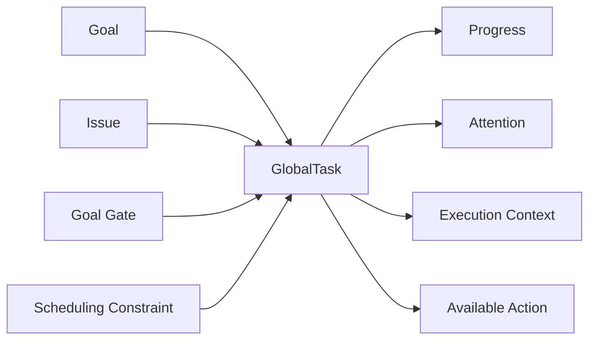

# Web UI V1 数据模型与接口契约

## 1. 目的与边界

本文定义研发工作台 V1 首屏所需的权威数据模型和 HTTP 接口。它解决三个问题：

1. 整体运行是否健康；
2. 当前最该处理什么；
3. 系统正在推进什么。

本契约只覆盖工作台首屏、任务详情和首屏任务操作。Goal 澄清、Issue 方案审批、执行日志、
全局调度策略和目标验收使用独立接口，不在同一个聚合响应中展开全部明细。

原型中的 TypeScript 定义位于：

```text
prototype/web-ui/app/workbench/contracts.ts
```

## 2. 核心建模决定



- `GlobalTask` 是工作台统一的读取模型，不等同于数据库中的单一任务表。
- Issue、Goal 门禁和调度约束都可以投影成 `GlobalTask`，通过 `kind` 区分来源。
- “待处理问题”不是与任务并列的实体列表，而是 `GlobalTask.attention`。因此问题始终保留所属
  Goal、执行进度、Worker、影响范围和处理入口。
- 权威业务实体仍由各自领域服务维护；工作台服务通过读模型或物化视图聚合，不反向成为
  Goal、Issue、Run 或 Scheduler 的事实源。
- 组件只消费 `WorkbenchSnapshot`。接口字段到展示文案的格式化由前端选择器完成，筛选计数
  不在组件内硬编码。

## 3. V1 数据模型

### 3.1 WorkbenchSnapshot

| 字段 | 类型 | 说明 |
|---|---|---|
| `schemaVersion` | `"workbench.v1"` | 响应 Schema 版本，不随数据更新递增 |
| `revision` | `number` | 聚合快照版本，用于实时增量和缓存校验 |
| `generatedAt` | ISO 8601 | 服务端生成快照的时间 |
| `summary.metrics` | `WorkbenchMetric[]` | 首屏六项可操作统计 |
| `summary.taskCounts` | `Record<TaskFilter, number>` | 不受分页影响的任务筛选总数 |
| `tasks` | `GlobalTask[]` | 已按服务端规则排序的统一任务队列 |

### 3.2 GlobalTask

| 字段 | 类型 | 说明 |
|---|---|---|
| `id` | `string` | 稳定任务 ID，例如 `DEV-07` |
| `version` | `number` | 乐观锁版本；所有写操作必须携带 |
| `goalId` | `string` | 所属 Goal |
| `kind` | `issue \| gate \| scheduling` | Issue、Goal 门禁或调度任务 |
| `priority` | `P0 \| P1 \| P2` | 已批准的业务优先级 |
| `stage` | `running \| review \| blocked \| waiting` | 工作台生命周期分组 |
| `status` | `TaskStatus` | 可展示的精确状态码、文案和色调 |
| `progress` | `TaskProgress` | 百分比、完成单元和更新时间 |
| `attention` | `TaskAttention` | 是否需人工处理、问题摘要和排序解释 |
| `execution` | `TaskExecutionContext` | Worker/调度器、耗时和下一检查点 |
| `action` | `TaskAction` | 当前用户唯一推荐主操作 |
| `detail` | object | 行展开所需的依赖、证据和工作区摘要 |

`GlobalTask` 是只读投影。写入时必须调用对应领域命令，不能 `PUT` 整个任务对象。

### 3.3 TaskAttention

| 字段 | 类型 | 说明 |
|---|---|---|
| `required` | `boolean` | 是否需要人工或外部系统介入 |
| `count` | `number` | 未解决问题数量 |
| `severity` | `none \| warning \| blocking` | 影响等级 |
| `headline` | `string` | 首屏单行摘要 |
| `rankingReason` | `string` | 服务端生成的可解释排序原因 |
| `impact` | `string` | 对 Goal、Wave、Worker 或交付门禁的影响 |
| `dueAt` | ISO 8601，可选 | 明确截止时间 |
| `waitingSeconds` | `number`，可选 | 已等待时长；由服务端计算，避免客户端时钟漂移 |
| `blockedTaskCount` | `number`，可选 | 被该问题阻塞的下游任务数 |

V1 首屏只展示一个 `headline`。任务详情接口可以返回完整问题集合，但首屏排序不能依赖客户端
对问题数组的临时推断。

### 3.4 TaskProgress

- `percent` 范围为 `0..100`。
- `completedUnits` 与 `totalUnits` 用于测试条目、策略回放等可计数工作，可为空。
- `updatedAt` 必须是产生进度的领域事件时间，不是工作台轮询时间。
- 阻塞或等待不等于进度归零；保留最后一次真实执行进度。

### 3.5 TaskAction

V1 支持：

```text
review_evidence
answer_questions
resolve_blocker
inspect_schedule
inspect_run
```

服务端必须按当前用户权限和任务状态计算推荐操作，并通过 `available`、`requiredRole` 和
`unavailableReason` 表达权限。前端不能只靠隐藏按钮实现授权。

## 4. 排序与统计口径

默认队列由服务端稳定排序，前端不重新解释优先级：

1. `attention.required = true` 置顶；
2. 业务优先级 `P0 → P1 → P2`；
3. 距离截止时间更近；
4. `blockedTaskCount` 更大；
5. `waitingSeconds` 更长；
6. 使用 `id` 作为稳定排序兜底。

`rankingReason` 是排序结果的解释，不是排序输入本身。统计口径：

- 需处理：`attention.required = true`；
- 执行中：`stage = running`；
- 阻塞：`stage = blocked`；
- Review、等待同理；
- 活跃 Worker、今日完成、预算健康由 Scheduler/Run 聚合服务提供，不能从当前分页任务反推。

筛选可以重叠。例如 Review 任务也可能同时属于“需处理”。

## 5. HTTP 接口

### 5.1 获取首屏快照

```http
GET /api/v1/workbench?goalId=GOAL-2407&filter=attention&limit=50&cursor=...
If-None-Match: "workbench-21"
```

成功返回 `200`；快照未变化返回 `304`。

```json
{
  "data": {
    "schemaVersion": "workbench.v1",
    "revision": 21,
    "generatedAt": "2026-08-03T14:32:00+08:00",
    "summary": { "metrics": [] },
    "tasks": []
  },
  "page": { "nextCursor": null, "total": 7 },
  "requestId": "req_01K..."
}
```

响应头：

```http
ETag: "workbench-21"
Cache-Control: private, no-cache
```

### 5.2 获取任务详情

```http
GET /api/v1/tasks/{taskId}
```

返回完整 `GlobalTask`，后续可增加 `attentionItems`、`evidenceRefs` 和 `dependencyRefs`，但不能
改变 V1 已有字段含义。

### 5.3 执行任务操作

```http
POST /api/v1/tasks/{taskId}/actions
Content-Type: application/json
Idempotency-Key: 41f0e79b-...
```

```json
{
  "action": "review_evidence",
  "expectedVersion": 12,
  "reason": "接受内部部署边界例外",
  "input": {
    "decision": "approve"
  }
}
```

所有可能触发 Planner、Scheduler、Worker、验证或 Artifact 处理的操作立即返回 `202` receipt：

```json
{
  "receiptId": "rcpt_01K...",
  "requestId": "req_01K...",
  "status": "accepted",
  "taskId": "DEV-07",
  "taskVersion": 13,
  "submittedAt": "2026-08-03T14:35:08+08:00",
  "statusUrl": "/api/v1/receipts/rcpt_01K..."
}
```

要求：

- `Idempotency-Key` 在组织、用户和接口范围内至少保留 24 小时；
- `expectedVersion` 不匹配返回 `409 version_conflict`；
- 高风险决定必须校验 `reason`；
- 审计事件保存 actor、reason、对象版本、请求 ID、前后状态和策略版本；
- 命令成功不代表异步工作已经完成，前端根据 receipt 或实时事件更新。

### 5.4 Receipt 状态

```http
GET /api/v1/receipts/{receiptId}
```

状态为 `accepted | running | completed | failed`。完成响应应包含新任务版本；失败响应使用统一错误
结构，并说明已保存内容和下一步。

### 5.5 实时更新

V1 推荐 Server-Sent Events：

```http
GET /api/v1/workbench/events?afterRevision=21
Accept: text/event-stream
```

事件类型：

```text
workbench.snapshot.invalidated
task.updated
metric.updated
receipt.updated
```

事件只携带 ID、版本和必要摘要。客户端发现 revision 跳跃或断线后重新请求完整快照，不在浏览器
内重建权威状态。

## 6. 错误协议

所有非 2xx 响应使用 `ApiErrorEnvelope`：

```json
{
  "error": {
    "code": "version_conflict",
    "message": "任务已由其他审批人更新",
    "impact": "本次决定未提交",
    "preservedState": "你的理由草稿仍保留在当前页面",
    "nextAction": "刷新任务详情后重新确认"
  },
  "requestId": "req_01K..."
}
```

V1 错误码：`validation_failed`、`forbidden`、`not_found`、`version_conflict`、
`invalid_transition`、`rate_limited`、`internal_error`。

## 7. 认证、授权与隐私

- 每个请求由服务端校验组织、项目和 Goal 权限。
- 工作台只返回当前用户可见的 Goal 与任务；统计也按相同权限范围聚合，避免数量泄露。
- Artifact、日志和工作区路径仅返回脱敏摘要；下载使用短期签名 URL 和单独权限检查。
- 任务操作最小角色：Review/回答问题为 `Approver`，处理调度阻塞为 `Operator`，查看为 `Viewer`。
- 前端显示服务端返回的 `action.available` 和拒绝原因，不自行推断授权。

## 8. 前端组件边界

```text
app/page.tsx                              页面入口
app/workbench/contracts.ts                V1 DTO、命令和错误类型
app/workbench/workbench-api.ts             浏览器 HTTP 适配器与 ETag 缓存
app/workbench/selectors.ts                筛选、计数和格式化纯函数
app/workbench/server/workbench-repository.ts 服务端读仓库接口与 Demo 实现
app/workbench/server/workbench-repository-factory.ts 数据源选择与仓库装配
app/workbench/server/postgres-workbench-repository.ts PostgreSQL 投影映射
app/workbench/server/neon-workbench-store.ts Neon/Drizzle 原子分页读取
app/workbench/server/neon-workbench-projection-writer.ts 投影批量替换入口
app/workbench/server/demo-workbench-snapshot.ts 服务端演示种子
db/postgres-schema.ts                     PostgreSQL 读模型表结构
drizzle-postgres/                         PostgreSQL 迁移记录
app/api/v1/workbench/route.ts              V1 聚合读取接口
app/workbench/components/workbench-app.tsx 状态协调与页面路由
app/workbench/components/app-shell.tsx     Sidebar、Topbar
app/workbench/components/overview-view.tsx 首屏统计与统一任务队列
app/workbench/components/*-view.tsx        各独立业务视图
app/workbench/components/ui.tsx            通用状态、进度和 Stepper
```

当前页面已经通过服务端仓库完成 SSR，并在 hydration 后使用 `WorkbenchApi.getWorkbench()` 刷新。
仓库工厂根据环境选择 Demo 或 PostgreSQL 实现；页面组件不读取数据库字段、拼接领域状态或自行
计算服务端排序。

## 9. PostgreSQL 读模型与运行契约

PostgreSQL 只承载工作台投影，不替代 Goal、Issue、Run 或 Scheduler 的事实表：

- `workbench_snapshots`：每个 `scope_id` 保存 revision、生成时间和全局 summary；
- `workbench_tasks`：每个 `scope_id + task_id` 保存稳定 rank、筛选列和完整 `GlobalTask` JSON；
- 分页读取把 snapshot、任务页和 total 放在同一个 Neon/Drizzle batch 中，避免一次响应混用不同
  revision 的结果；
- 投影发布由聚合器调用 `NeonWorkbenchProjectionWriter.replaceProjection()`，同一 scope 必须单写者
  串行发布，revision 必须单调递增；
- scope 是租户/项目隔离键。上线前仍须在事实源、投影写入和 API 鉴权三层校验用户可见范围。

运行配置：

| 环境变量 | 默认值 | 行为 |
|---|---|---|
| `WORKBENCH_DATA_SOURCE` | `auto` | `auto \| demo \| postgres`；生产环境应显式使用 `postgres` |
| `DATABASE_URL` | 无 | Neon/PostgreSQL 连接串；显式 PostgreSQL 模式缺失时启动读取会失败 |
| `WORKBENCH_SCOPE_ID` | `default` | 当前工作台投影 scope |

初始化命令：

```bash
cd prototype/web-ui
export DATABASE_URL='postgresql://...'
export WORKBENCH_SCOPE_ID='default'
npm run db:migrate:postgres
npm run db:seed:postgres
WORKBENCH_DATA_SOURCE=postgres npm run dev
```

`db:seed:postgres` 只用于首次验证，会把服务端 Demo snapshot 写入指定 scope。正式数据由聚合器
发布。接口通过 `x-workbench-source: demo | postgres` 暴露当前读取源，便于部署巡检；生产环境使用
显式 `postgres` 模式，避免数据库 Secret 丢失时静默退回演示数据。

## 10. 后端实现验收清单

- OpenAPI Schema 与 `contracts.ts` 字段一致；
- 默认队列排序对相同快照稳定；
- 统计不受任务分页影响；
- 任务写操作具备权限校验、乐观锁、幂等键和审计；
- 异步操作在 500ms 内返回 receipt；
- 断线重连可以按 revision 恢复，无法恢复时回退到完整快照；
- 错误同时说明影响、已保存内容和下一步；
- 日志、证据和路径经过权限过滤与脱敏。
